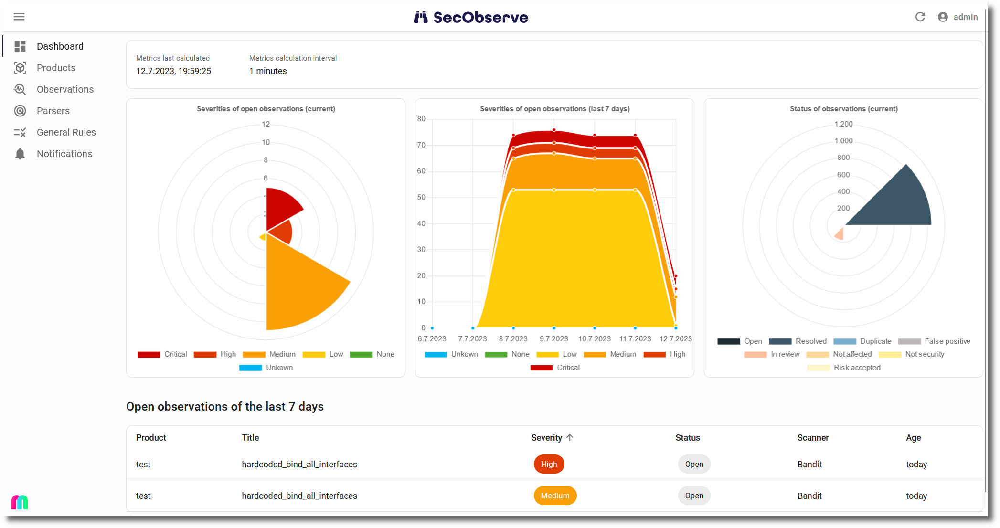
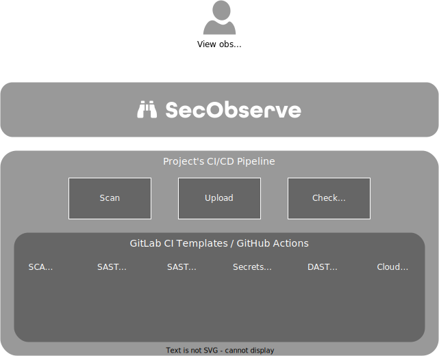

> [!IMPORTANT]
> The SecObserve repositories have been moved from the MaibornWolff organization to their own SecObserve organization. Even though all links to the previous repository location are automatically redirected to the new location, we strongly recommend updating any existing links to the new repository URL.
>
> The location of the Docker images has been changed with release 1.42.0, they are now stored in a GitHub container registry:
>
> * ghcr.io/secobserve/secobserve-backend (see https://github.com/SecObserve/SecObserve/pkgs/container/secobserve-backend)
> * ghcr.io/secobserve/secobserve-frontend (see https://github.com/SecObserve/SecObserve/pkgs/container/secobserve-frontend)

# SecObserve

 

SecObserve is an open source vulnerability and license management system for software development teams and cloud environments. It supports a variety of open source vulnerability scanners and integrates easily into CI/CD pipelines. Results about potential security flaws from various vulnerability scanning tools are made available for assessment and reporting.

## Overview

The aim of SecObserve is to make vulnerability scanning and vulnerability management as easy as possible for software development projects using open source tools. It consists of 2 major components:

* **Vulnerability and license management system SecObserve:** SecObserve provides the development team with an overview of the results of all vulnerability and license scans for their project, which can be easily filtered and sorted. In the detailed view, the results are displayed uniformly with a wealth of information, regardless of which vulnerability scanner generated them.

    With the help of automatically executed rules and manual assessments, the vulnerability results can be efficiently evaluated to eliminate irrelevant results and accept risks. This allows the development team to concentrate on fixing the relevant vulnerabilities.

* **GitLab CI templates and GitHub actions:** Integrating vulnerability scanners into a CI/CD pipeline can be tedious. Each tool has to be installed differently and is called with different parameters. To avoid having to solve this task all over again, there are repositories with GitLab CI Templates and GitHub Actions. These make the process of integrating vulnerability scanners very simple by providing uniform methods for launching the tools and uniform parameters. The tools are regularly updated in the repositories so that the latest features and bug fixes are always available.

    All templates run the scanner, upload the results into SecObserve and make the results of the scans available for download as artefacts in JSON format.

    The sources of the GitHub actions and GitLab CI templates can be found in [https://github.com/SecObserve/secobserve_actions_templates](https://github.com/SecObserve/secobserve_actions_templates).

## Integrations

## Documentation

The full documentation how to install and use SecObserve can be found here: [https://secobserve.github.io/SecObserve/](https://secobserve.github.io/SecObserve/)

## Code of Conduct

Please note that this project is released with a [Code of Conduct](CODE_OF_CONDUCT.md). By participating in this project you agree to abide by its terms.

## Contributing

Please see the [Contributing Guidelines](CONTRIBUTING.md) for more information on how to get involved in the project.

## License

SecObserve is licensed under the [3-Clause BSD License](LICENSE.txt)
