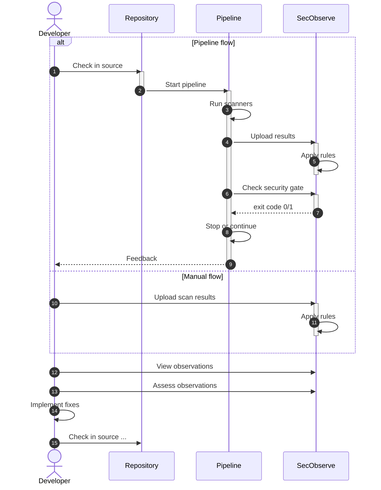
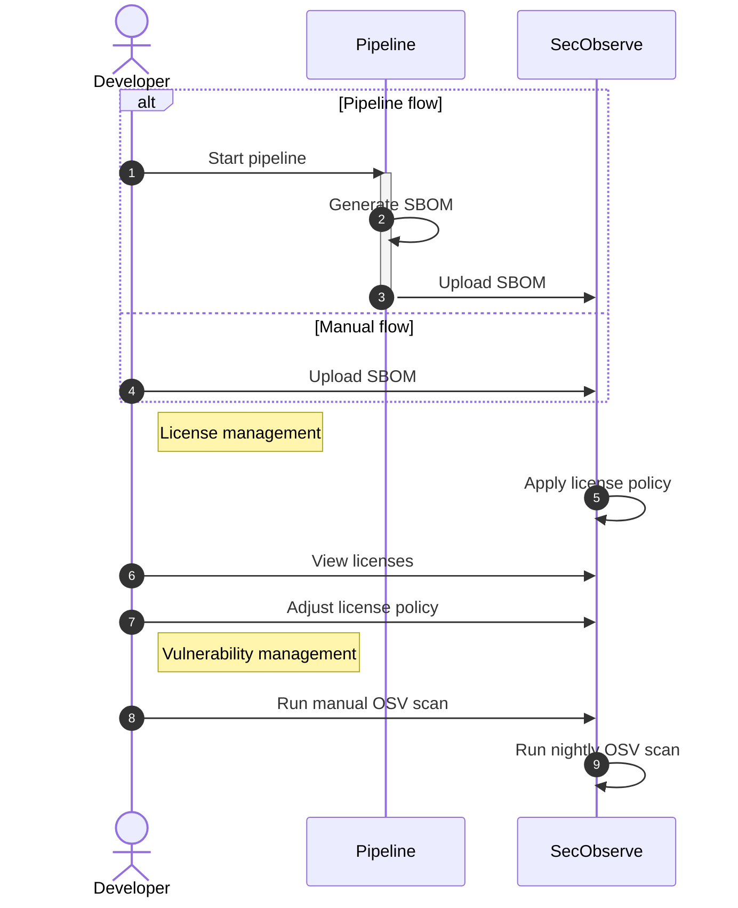

# About SecObserve

!!! note "SecObserve in a nutshell"
    SecObserve is an open source vulnerability and license management system for software development teams and cloud environments. It supports a variety of open source vulnerability scanners and integrates easily into CI/CD pipelines.

## Overview

The aim of SecObserve is to make vulnerability scanning and vulnerability management as easy as possible for software development projects using open source tools. It consists of 2 major components:

* **Vulnerability and license management system SecObserve:** SecObserve provides the development team with an overview of the results of all vulnerability and license scans for their project, which can be easily filtered and sorted. In the detailed view, the results are displayed uniformly with a wealth of information, regardless of which vulnerability scanner generated them.

    With the help of automatically executed rules and manual assessments, the vulnerability results can be efficiently evaluated to eliminate irrelevant results and accept risks. This allows the development team to concentrate on fixing the relevant vulnerabilities.

* **GitLab CI templates and GitHub actions:** Integrating vulnerability scanners into a CI/CD pipeline can be tedious. Each tool has to be installed differently and is called with different parameters. To avoid having to solve this task all over again, there are repositories with GitLab CI Templates and GitHub Actions. These make the process of integrating vulnerability scanners very simple by providing uniform methods for launching the tools and uniform parameters. The tools are regularly updated in the repositories so that the latest features and bug fixes are always available.

    All actions and templates run the scanner, upload the results into SecObserve and make the results of the scans available for download as artefacts in JSON format.

    The sources of the GitHub actions and GitLab CI templates can be found in [https://github.com/MaibornWolff/secobserve_actions_templates](https://github.com/MaibornWolff/secobserve_actions_templates).

{ width="700" style="display: block; margin: 0 auto" }

## Workflows

There are 2 main workflows when working with SecObserve:

1. **Consuming results of vulnerability scanners:** In this workflow, a pipeline runs one or more vulnerability scanners and uploads the results into SecObserve. The developers can then view and assess the observations and take action accordingly.

    This workflow is typically used in a CI/CD pipeline, but can also be used manually.

2. **Consuming SBOMs for license and vulnerability management:** Here a Software Bill of Materials (SBOM) is ingested into SecObserve to provide insights into the components and licenses used in the product. It is a precondition for scanning the components for vulnerabilities with the OSV scanner.

    This workflow can also be used in a CI/CD pipeline or manually.

#### Consuming results of vulnerabilits scanners

1. A developer implements a feature and checks in his code to the repository
2. The repository starts a pipeline for the change
3. The pipeline runs one or more of the supported vulnerability scanners. To make integration easy, SecObserve provides predefined GitHub actions and GitLab templates for the most relevant scanners, see [GitHub actions and GitLab CI templates](../integrations/github_actions_and_templates.md).
4. The scanners store their results in files, which are [uploaded into SecObserve](../usage/import_observations.md).
5. SecObserve applies [rules](../usage/rule_engine.md) to adjust severity and status of observations during the upload process.
6. The pipeline can call SecObserve to check the status of the [security gate](../usage/security_gates.md).
7. SecObserve returns an exit code to the pipeline: 
    * `1` if the security gate has **failed**
    * `0` if the security gate has **passed** or is **disabled**
8. The pipeline can stop or continue based on the exit code, depending on the configuration of the check step. Default is to stop the pipeline if the security gate has failed.
9. The developer can see the result of the pipeline.
10. Alternatively, the developer can upload the results manually into SecObserve ...
11. ... and SecObserve applies the [rules](../usage/rule_engine.md) to adjust severity and status of observations.
12. The developer can now look at the observations in SecObserve, to see what has changed ...
13. ... and if necessary [assess observations](../usage/assess_observations.md) to change their status (eg. false positive or risk accepted) or severity.
14. If fixes are needed to close vulnerabilities, the developer will implement the fixes ...
15. ... and check them in to the repository. Now the cycle starts again.

#### Consuming SBOMs for license and vulnerability management

1. A developer starts a pipeline ...
2. ... to generate a Software Bill of Materials (SBOM) for the project.
3. The pipeline [uploads the SBOM](../usage/upload_sbom.md) into SecObserve.
4. Alternatively, the developer can upload the SBOM manually into SecObserve.
5. SecObserve applies the [license policy](../usage/license_management.md#evaluation-of-licenses) to the SBOM to check for license compliance.
6. The developer can [view the licenses and their evaluation results](../usage/license_management.md#managing-licenses-in-products) in SecObserve ...
7. ... and [adjust the license policy](../usage/license_management.md#managing-license-policies) if necessary.
8. The developer can run a [manual OSV scan](../integrations/osv_scan.md#manual-scan) to check for vulnerabilities in the components of the SBOM.
9. Alternatively, SecObserve can run a [nightly OSV scan](../integrations/osv_scan.md#automatic-scan) to check for vulnerabilities in the components of the SBOM.
