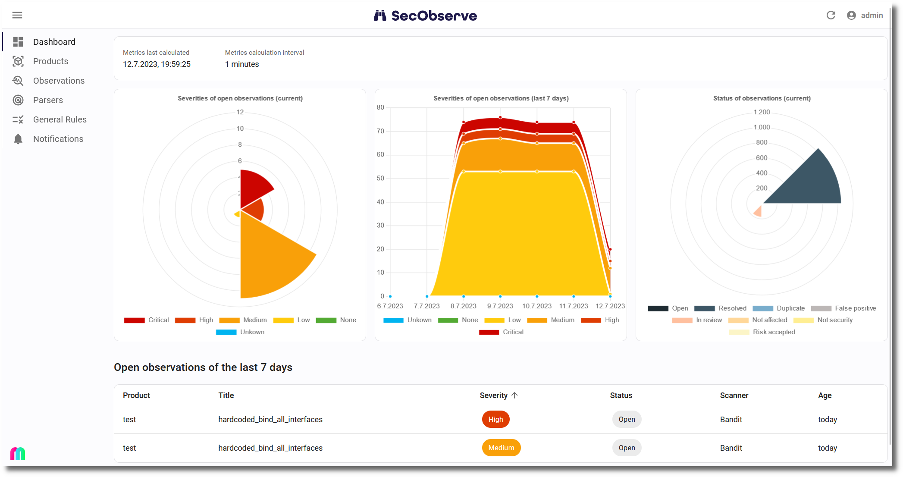
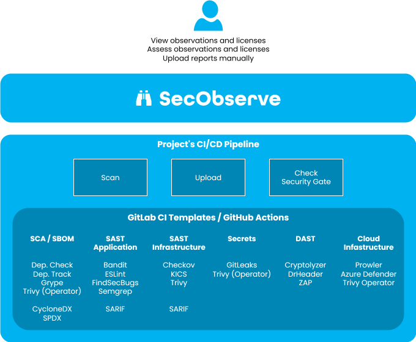

# About SecObserve

!!! note "SecObserve in a nutshell"
    SecObserve is an open source vulnerability management system for software development and cloud environments. It supports a variety of open source vulnerability scanners and integrates easily into CI/CD pipelines.

## Overview

The aim of SecObserve is to make vulnerability scanning and vulnerability management as easy as possible for software development projects using open source tools. It consists of 2 major components:

* **Vulnerability management system SecObserve:** SecObserve provides the development team with an overview of the results of all vulnerability scans for their project, which can be easily filtered and sorted. In the detailed view, the results are displayed uniformly with a wealth of information, regardless of which vulnerability scanner generated them.

    With the help of automatically executed rules and manual assessments, the results can be efficiently evaluated to eliminate irrelevant results and accept risks. This allows the development team to concentrate on fixing the relevant vulnerabilities.

* **GitLab CI templates and GitHub actions:** Integrating vulnerability scanners into a CI/CD pipeline can be tedious. Each tool has to be installed differently and is called with different parameters. To avoid having to solve this task all over again, there are repositories with GitLab CI Templates and GitHub Actions. These make the process of integrating vulnerability scanners very simple by providing uniform methods for launching the tools and uniform parameters. The tools are regularly updated in the repositories so that the latest features and bug fixes are always available.

    All actions and templates run the scanner, upload the results into SecObserve and make the results of the scans available for download as artefacts in JSON format.

    The sources of the GitHub actions and GitLab CI templates can be found in [https://github.com/MaibornWolff/secobserve_actions_templates](https://github.com/MaibornWolff/secobserve_actions_templates).

{ width="700" style="display: block; margin: 0 auto" }

## Procedure

A sequence diagram explains the basic procedure how to work with SecObserve:

1. A developer implements a feature and checks in his code to the repository
2. The repository starts a pipeline for the change
3. The pipeline runs several of the supported vulnerability scanners. To make integration easy, SecObserve provides predefined templates for the most relevant scanners, see [GitHub actions and GitLab CI templates](../integrations/github_actions_and_templates.md).
4. The scanners store their results in files, which are [uploaded into SecObserve](../usage/import_observations.md).
5. SecObserve applies [rules](../usage/rule_engine.md) to adjust severity and status of observations during the upload process.
6. The developer can now look at the observations in SecObserve, to see what has changed ...
7. ... and if necessary [assess observations](../usage/assess_observations.md) to change their status (eg. false positive or risk accepted) or severity.
8. If fixes are needed to close vulnerabilities, the developer will implement the fixes ...
9. ... and check them in to the repository. Now the cycle starts again.
