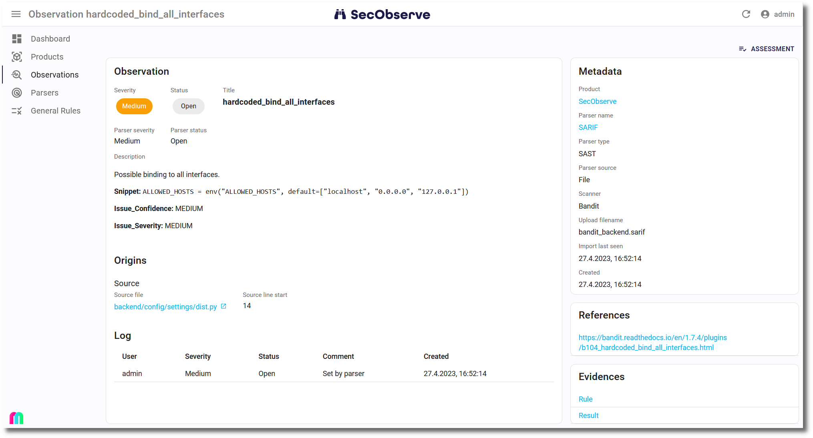

# Anatomy of an observation

## Observation

* The **Severity** can have 3 sources: 
    * Initially the parser sets a severity, based on the incoming data. 
    * If there is a [rule](../usage/rule_engine.md) configured that matches the observation, it overrides the severity set by the parser.
    * When a user [assesses the observation](../usage/assess_observations.md) and sets a different severity, this severity from the assessment overrides the severity set by a rule and the severity set by the parser.
* The initial **Status** set by an import is `Open`. It will be set to `Resolved` if the [same observation](../usage/import_observations.md#import-algorithm) is not found in a subsequent import. On the other hand, resolved observations are set back to the status `Open` if they reappear in a later import.  
As for the severity, if a [rule](../usage/rule_engine.md) matches the observation or a user sets a different status in an [assessment](../usage/assess_observations.md), these changes will override the status set by the import.
* **Title** and **Description** are short and long explanations what the observation is about.
* Scanners might suggest a **Recommendation** *(not shown in the screenshot)*.

## Vulnerability

*(not shown in the screenshot)*

Vulnerability data can comprise a **Vulnerability Id** like a CVE or GHSA, a **CVSSv3 score** / **CVSSv3 vector** and/or **CVSSv4 score** / **CVSSv4 vector** as well as a **CWE** number.

## Origins

An observation can be found at different origins:

* **Service**: A service is a self-contained piece of functionality within a product. This can be something like *frontend* or *backend* or the name of a microservice.
* **Component**: Typically a library (Maven, NPM, PyPI, ...) or a program installed in a docker image, identified by name and version.
* **Docker image**: Name and tag of a Docker image, where the observation was found.
* **Endpoint**: The URL of a web address.
* **Source file**: Path and name of a source file, start and end lines are optional. The source file will be shown as a link to the source in the repository, if a **Repository prefix** has been configured in the product.
* **Cloud**: The name of the cloud provider, account (AWS) or subscription (Azure) or project (GCP), resource and resource type, where the observation was found.

## Log

Every time either the severity or the status get changed by an import or an assessment, this event is recorded in the **Observation Log** together with a comment.

## Potential duplicates

*(not shown in the screenshot)*

If an observation has [potential duplicates](../usage/duplicates.md#identify-potential-duplicates), they are listed here and can be [marked as duplicates](../usage/duplicates.md#mark-duplicates).

## Metadata

Some information about how the observation was created or updated.

## References

`References` are links to further information about the observation. They are imported with the observation.

## Evidences

`Evidences` are extracts from the scan reports showing the basis on which the observation was created.
