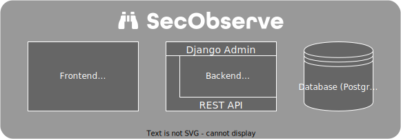

# Architecture

{ align=center, width="800" }

## Frontend

The frontend is a single page application (SPA), implemented with TypeScript, React and the [React-Admin framework](https://marmelab.com/react-admin). The page is delivered by a nginx server.

## Backend

The backend is implemented with Python and [Django](https://www.djangoproject.com) / [Django Rest Framework](https://www.django-rest-framework.org). A Gunicorn server delivers 2 major components:

#### REST API

The REST API is used by the frontend to serve and manipulate data and by CI/CD pipelines to upload scan results.

#### Django Admin

The Django Admin interface is used by administrators to manage users and some system-wide configurations.

## Database

Currently MySQL and PostgreSQL are supported as databases.
