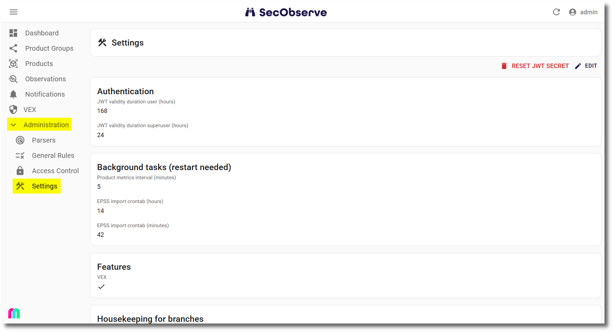

# Configuration

## Deployment

A part of the configuration is done with environment variables, which need to be set when deploying SecObserve. How this is done depends on the deployment method, see [Installation](installation.md).

#### Backend

| Environment variable   | Optionality | Description |
|------------------------|:-----------:|-------------|
| `ADMIN_USER`           | mandatory   | Username of the administration user. The user will be created at the fist start of the backend. |
| `ADMIN_EMAIL`          | optional    | E-Mail of the administration user. |
| `ADMIN_PASSWORD`       | optional    | Initial password of the admin user. If it is not set, a random password will be created during startup and shown in the log. |
| `ALLOWED_HOSTS`        | mandatory   | Hostnames of the backend, see [Django settings ALLOWED_HOSTS](https://docs.djangoproject.com/en/5.1/ref/settings/#allowed-hosts). This can be a comma-separated list of hostnames. |
| `CORS_ALLOWED_ORIGINS` | mandatory   | URL of the frontend that is authorized to make cross-site HTTP requests. This can be a comma-separated list of URLs. |
| `DATABASE_HOST`        | mandatory   | Which host to use when connecting to the database. |
| `DATABASE_DB`          | mandatory   | The name of the database to use. |
| `DATABASE_PORT`        | mandatory   | The port to use when connecting to the database. |
| `DATABASE_USER`        | mandatory   | The username to use when connecting to the database. |
| `DATABASE_PASSWORD`    | mandatory   | The password to use when connecting to the database. |
| `DATABASE_ENGINE`      | mandatory   | The database backend to use. Supported database backends are `django.db.backends.mysql` and `django.db.backends.postgresql` |
| `MYSQL_AZURE`          | optional    | Must be set if Azure Database for MySQL is used, to use the necessary SSL certificate. For **MySQL Flexible Server** it needs to have the value `flexible`, for **MySQL Single Server** the the value needs to be `single`. See [Connect using mysql command-line client with TLS/SSL](https://learn.microsoft.com/en-us/azure/mysql/flexible-server/how-to-connect-tls-ssl#connect-using-mysql-command-line-client-with-tlsssl) and [Configure SSL connectivity in your application to securely connect to Azure Database for MySQL](https://learn.microsoft.com/en-us/azure/mysql/single-server/how-to-configure-ssl#step-1-obtain-ssl-certificate).
| `DJANGO_SECRET_KEY`    | mandatory   | A secret key for a particular Django installation. This is used to provide cryptographic signing, and should be set to a unique, unpredictable value with at least 50 characters, see [Django settings SECRET_KEY](https://docs.djangoproject.com/en/5.1/ref/settings/#secret-key).
| `FIELD_ENCRYPTION_KEY` | mandatory   | Key to encrypt fields like the JWT secret. See [Generating an Encryption Key](https://gitlab.com/lansharkconsulting/django/django-encrypted-model-fields#generating-an-encryption-key) how to generate the key. |
| `GUNICORN_WORKERS`     | optional   | Number of worker processes for the Gunicorn web server, see [Gunicorn documentation](https://docs.gunicorn.org/en/stable/design.html#how-many-workers). Default is 3. |
| `GUNICORN_THREADS`     | optional   | Number of worker threads for the Gunicorn web server, default is 10. |
| `GUNICORN_LIMIT_REQUEST_FIELD_SIZE` | optional | Limits the allowed size of an HTTP request header field, default is 16380. |
| `OIDC_AUTHORITY`       | mandatory   | The authority is a URL that hosts the OpenID configuration well-known endpoint.  |
| `OIDC_CLIENT_ID`       | mandatory   | The client ID is the unique *Application (client) ID* assigned to your app by the OpenID Connect provider when the app was registered. |
| `OIDC_USERNAME`        | mandatory   | The claim that contains the username to find or create the user. |
| `OIDC_FIRST_NAME`      | mandatory   | The claim that contains the first name of the user. |
| `OIDC_LAST_NAME`       | mandatory   | The claim that contains the last name of the user. |
| `OIDC_FULL_NAME`       | mandatory   | The claim that contains the full name of the user. |
| `OIDC_EMAIL`           | mandatory   | The claim that contains the email address of the user. |
| `OIDC_GROUPS`          | optional    | The claim that contains the groups of the user. |

#### Frontend

| Environment variable            | Optionality | Description |
|---------------------------------|:-----------:|-------------|
| `API_BASE_URL`                  | mandatory   | URL where to find the backend API, e.g. `https:\\secobserve-backend.example.com/api`. |
| `OIDC_ENABLE`                   | mandatory   | `true`: OpenID Connect authentication is active, `false`: otherwise. |
| `OIDC_AUTHORITY`                | mandatory   | The authority is a URL that hosts the OpenID Connect configuration well-known endpoint. |
| `OIDC_CLIENT_ID`                | mandatory   | The client ID is the unique *Application (client) ID* assigned to your app by the OpenID Connect provider when the app was registered. |
| `OIDC_REDIRECT_URI`             | mandatory   | The redirect URI is the URI the identity provider will send the security tokens back to. To be set with the URL of the frontend. |
| `OIDC_POST_LOGOUT_REDIRECT_URI` | mandatory   | The post logout redirect URI is the URI that will be called after logout. To be set with the URL of the frontend. |
| `OIDC_SCOPE`                    | optional    | OpenID Connect (OIDC) scopes are used by an application during authentication to authorize access to a user's details, like name or email. If the variable is not set, the standard scopes `openid profile email` will be used. |

All the `OIDC_*` environment variables are needed for technical reasons. If `OIDC_ENABLE` is set to `false`, the other `OIDC_*` environment variables can be set to `dummy` or something similar.

More about the configuration for different OpenID Connect providers can be found in [OpenID Connect authentication](../integrations/oidc_authentication.md).

## Admininistration in SecObserve

Other parts of the configuration are done in the administration interface of SecObserve under `Settings`, which can only be accessed by users with the role `Superuser`.

The entries shall be checked and adjusted if necessary after installing SecObserve.
