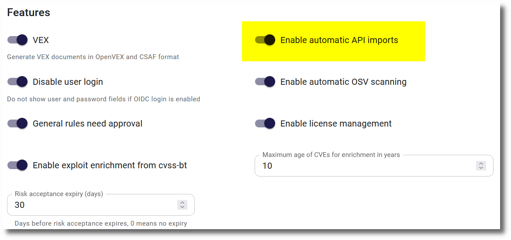

# API import

## API configuration

#### Dependency-Track

{ width="60%" style="display: block; margin: 0 auto" }

The Dependency-Track API configuration requires the URL of the Dependency-Track instance, an API key and a project key:

* The base URL of the Dependency-Track instance is something like `https://dependencytrack.example.com`
* The API key can be created for a team in the Access Management section of the Dependency-Track administration
* The project key is the identifier of the project in Dependency-Track. It can be found as the last part of the URL of the project page in the form of a UUID.

#### Trivy Operator Prometheus

{ width="60%" style="display: block; margin: 0 auto" }

The Trivy Operator must be installed with the Prometheus integration enabled as described in the [Trivy Operator documentation](https://aquasecurity.github.io/trivy-operator/v0.22.0/tutorials/grafana-dashboard/).

The Trivy Operator Prometheus API configuration requires the URL of the Prometheus instance, a query and optionally a basic authentication:

* The base URL of the Dependency-Track instance is something like `https://prometheus.example.com`
* The query is a Prometheus query that returns the desired data. Currently there a these options:

    * `trivy_compliance_info`: Compliance information of the whole cluster related to CIS and NSA/CISA guidelines
    * `trivy_configaudits_info`: Misconfigurations of the cluster
    * `trivy_exposedsecrets_info`: Exposed secrets in deployed Docker images
    * `trivy_rbacassessments_info`: Failed assessment results for the role-based access control (RBAC) of the cluster
    * `trivy_vulnerability_id`: Known vulnerabilities in deployed Docker images

* If the Prometheus instance is protected by basic authentication, the username and password can be entered after turning `Basic authentication` on.

## Automatic import

API imports can be configured to run automatically at a specific time. There is a general setting and a setting per API configuration.

#### General setting

In the `Features` section of the [Settings](../getting_started/configuration.md#admininistration-in-secobserve) the automatic import can be enabled for the whole SecObserve instance.

{ width="80%" style="display: block; margin: 0 auto" }

The hour (in UTC time) and minute, when the automatic API imports and the [OSV scanning](./osv_scan.md#automatic-scan) will run, can be set in the `Background tasks`  section. A restart of the SecObserve instance is required to apply the changes.

{ width="70%" style="display: block; margin: 0 auto" }

#### Setting per API configuration

Only API configurations that have `Automatic import enabled` turned on will be imported automatically. When the automatic import is enabled for an API configuration, the values for `Branch / Version`, `Service`, `Docker image name:tag`, `Endpoint URL`and `Kubernetes cluster` can be set to be used for the import.

{ width="80%" style="display: block; margin: 0 auto" }
