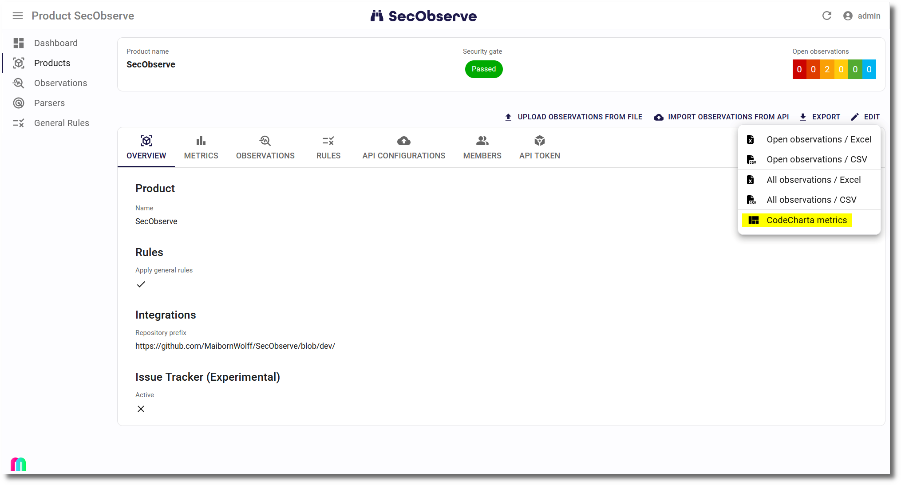

# CodeCharta

[CodeCharta](https://maibornwolff.github.io/codecharta/) is a tool to visualize software quality. It allows you to import and combine metrics from various sources like SonarQube, Svn, Git or directly from your source code. The visualization makes the quality of a code base tangible and can be used to gain insights and communicate with stakeholders.


## Export data from SecObserve

When showing a product, there is an `Export` button. When clicking it, it shows a menu including an option to export the metrics about observations of this product to CodeCharta:



This export produces a CSV file with severity metrics for all open observations that have a source file as an origin.

## Process data for CodeCharta

The CSV file needs to be converted to CodeCharta's JSON format. First the analysis tools of CodeCharta need to be [installed](https://maibornwolff.github.io/codecharta/docs/installation/). Then the exported metrics are converted like this:

```bash
ccsh csvimport secobserve_codecharta_metrics.csv -o secobserve_codecharta_metrics.cc.json
```

This produces the file `secobserve_codecharta_metrics.cc.json.gz`. This file can be visualized by CodeCharta, but contains only the source files with vulnerabilities.

To get a better picture of the whole system, this file can be combined with an export from [SonarQube](https://maibornwolff.github.io/codecharta/docs/sonar-importer) or the [Source Code Parser](https://maibornwolff.github.io/codecharta/docs/source-code-parser).

When SonarQube is used, the export from SonarQube will include an additional node with the id of the project, that needs to be removed:

```bash
ccsh modify -f root/csec_secobserve -t root -o secobserve_sonarqube_modified.cc.json.gz secobserve_sonarqube.cc.json.gz
```

Now the results from SonarQube and SecObserve can be merged:

```bash
ccsh merge secobserve_sonarqube_modified.cc.json secobserve_codecharta_metrics.cc.json.gz -o secobserve.cc.json.gz
```

## Visualize data in CodeCharta

The resulting file `secobserve.cc.json.gz` can now be visualized using [https://maibornwolff.github.io/codecharta/visualization/app/index.html](https://maibornwolff.github.io/codecharta/visualization/app/index.html). These SecObserve metrics are included:

* vulnerabilities_total
* vulnerabilities_critical
* vulnerabilities_high
* vulnerabilities_medium
* vulnerabilities_low
* vulnerabilities_none
* vulnerabilities_unknown
* vulnerabilities_high_and_above
* vulnerabilities_medium_and_above
* vulnerabilities_low_and_above
