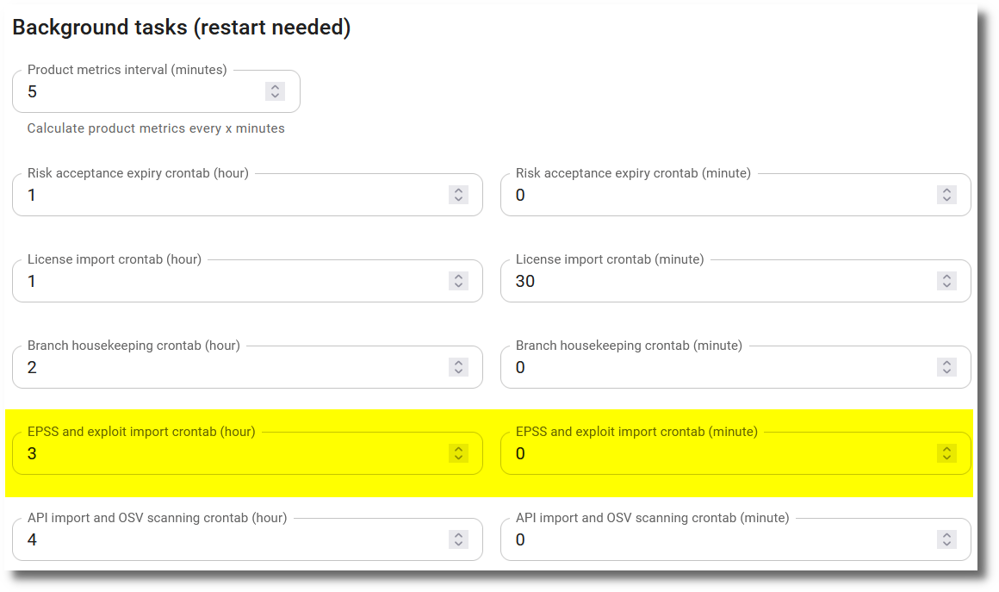

# Exploit Prediction Scoring System (EPSS)

The [Exploit Prediction Scoring System (EPSS)](https://www.first.org/epss/) is a data-driven effort for estimating the likelihood (probability) that a software vulnerability will be exploited in the wild. The EPSS model produces a **probability score** between 0 and 1 (0 and 100%) for all CVE vulnerabilities. The higher the score, the greater the probability that a vulnerability will be exploited. Additionally **percentiles** are calculated, which are a direct transformation from probabilities and provide a measure of an EPSS probability relative to all other scores. That is, the percentile is the proportion of all values less than or equal to the current rank. A good overview of EPSS scores and EPSS percentiles is given in [Probability, Percentiles, and Binning - How to understand and interpret EPSS Scores](https://www.first.org/epss/articles/prob_percentile_bins). The EPSS data is updated daily.

SecObserve imports the EPSS data and updates all observations with a CVE value with the EPSS score and EPSS percentile regularly. After an import of a vulnerability scan, all observations with a CVE number contained in the import are updated with the EPSS score and EPSS percentile as well.

## Configuration

Per default the task to import the EPSS data and update the observations is scheduled to run every night at 03:00 UTC time. This default can be changed by administrators via the **Background tasks** section in the [Settings](../getting_started/configuration.md#admininistration-in-secobserve).  Hours are always in UTC time.

{ width="80%" style="display: block; margin: 0 auto" }
