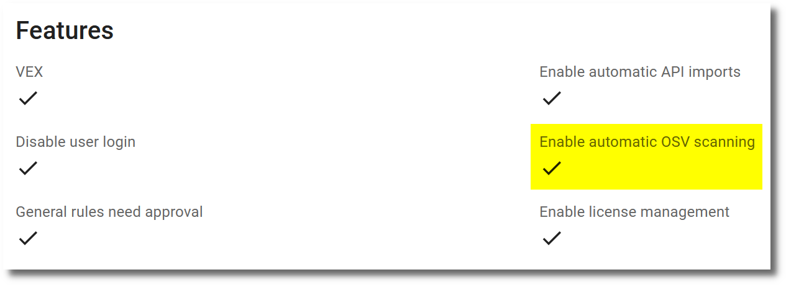

# Exploit information

Several databases and tools collect information about exploits of known vulnerabilities. This information is important to prioritize the remediation of vulnerabilities. The project [cvss-bt](https://github.com/t0sche/cvss-bt) collects information about exploits from various sources which can be imported automatically into SecObserve. The exploit information is linked to the corresponding observations via the CVE Id.

Exploit information from these sources is made available:

* [CISA Known Exploited Vulnerabilities Catalog](https://www.cisa.gov/known-exploited-vulnerabilities-catalog)
* [Exploit-DB](https://www.exploit-db.com)
* [Metasploit](https://www.metasploit.com)
* [Nuclei](https://docs.projectdiscovery.io/tools/nuclei/overview)
* [PoC GitHub](https://github.com/nomi-sec/PoC-in-GitHub)
* [VulnCheck KEV](https://vulncheck.com)

Observations can be filtered by the presence of exploit information and the links to exploit information are displayed in the observation details.

## Configuration

In the `Features` section of the [Settings](../getting_started/configuration.md#admininistration-in-secobserve) the import of exploit information can be enabled or disabled for the whole SecObserve instance. Additionally, the maximum age of CVEs can be set. Data for CVEs older than the specified number of days will not be imported.

{ width="65%" style="display: block; margin: 0 auto" }

The import of exploit information runs together with the EPSS import, see [EPSS import / Configuration](./epss.md#configuration).
