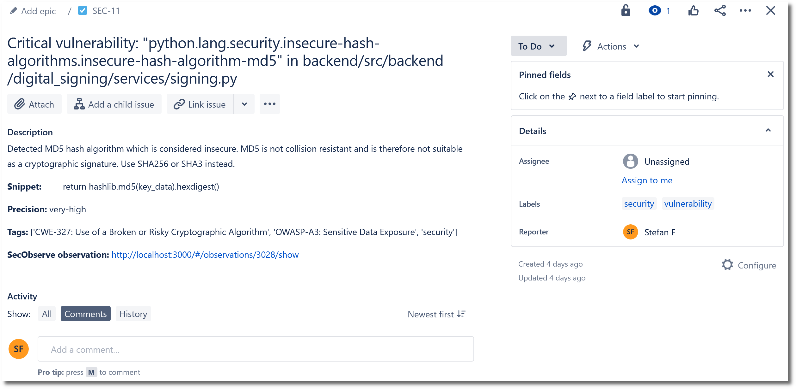

# Issue trackers

Developers and product owners will typically document the development tasks in an issue tracker and move these issues in a Scrum or Kanban board. Therefore, even though the assessment of observations is done in SecObserve, it may be useful to transfer them to an issue tracker as well. SecObserve currently supports automatic creation of issues in **GitHub**, **GitLab** and **Jira (Cloud)**. 

The synchronization of issues is an unidirectional process:

* A new observation will be pushed as an open issue, if its branch / version is set to the default branch / version of the product.
* If the observation changes its priority or description, the issue will be updated accordingly.
* If the observation changes the status from **Open** to another status by an assessment in SecObserve, the issue will be closed.
* If the observation gets the status **Resolved** in SecObserve because it is not found in the results anymore, the issue will be closed as well.
* If the observation is reopened in SecObserve by an assessment or because it has been found in the results again, the issue will be opened again.
* If the observation is deleted in SecObserve, the issue will be closed.

If the issue is closed or deleted in the issue tracker, it will be reopened or recreated with the next import of results in SecObserve, when the respective observation was still found and still has the status **Open** in SecObserve.

The parameters for the issue tracker integration are set in the product:

|                     |   |
|---------------------|---|
| **Active**          | Issues will only be pushed, if this parameter is set. |
| **Type**            | Either **GitHub** or **GitLab** or **Jira** |
| **Base URL**        | The base URL of the issue tracker. For **GitHub** it is `https://api.github.com`, for a self hosted **GitLab** it will be something like `https://gitlab.example.com`, for **Jira** it is `https:\\{organization_name}.atlassian.net`. |
| **API key**          | An API key must be created in the issue tracker, having the permissions to create and update issues. |
| **Project id**       | The path of the repository in its URL in **GitHub** or **GitLab**, e.g. `SecObserve/SecObserve`. For **Jira** it is the key of the project. |
| **Labels**           | A comma separated list of labels, that will be set for the issue. Additional labels can be set in the issue tracker, they will be preserved when the issue is updated. |
| **Minimum severity** | *(optional)* Issues will only be exported for observations with a severity that is higher or the same. |
| **Username**         | *(only for Jira)* The REST API of Jira needs an authentication with username and API key. |
| **Issue type**       | *(only for Jira)* The issue type to be created. |
| **Closed status**    | *(only for Jira)* The status to be set when an issue is closed. |

Issues are created or updated by an asynchronous background process after the import or the assessment of an observation has finished. If problems should occur during the transfer, a notification is send, see [Notifications](./notifications.md).

!!! tip

    Issues shouldn't be created when observations are imported the first time for a vulnerability scannner. First the number of observations should be minimized with settings of the vulnerability scanner of rules within SecObserve, before pushing issues to an issue tracker.

## Issue in GitHub

## Issue in GitLab

## Issue in Jira (Cloud)

