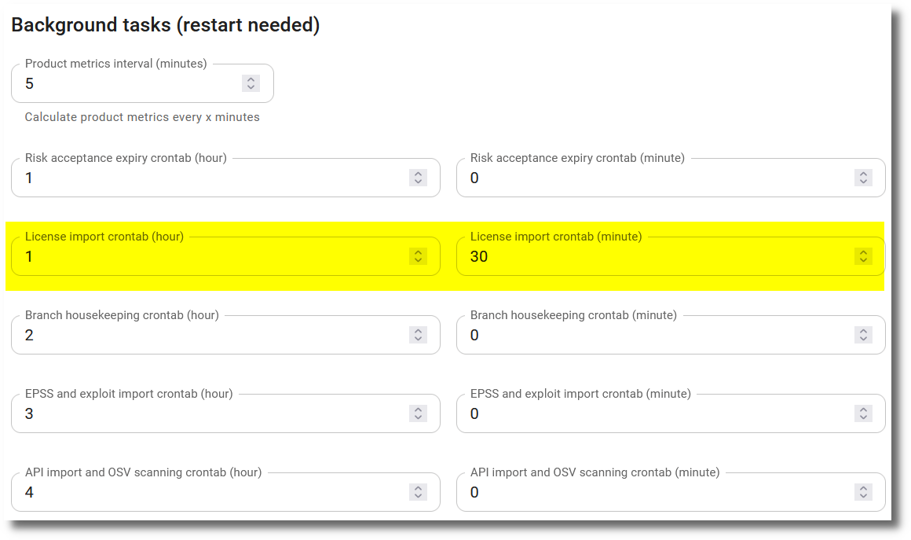

# License data import

## SPDX licenses

The [Linux Foundation](https://www.linuxfoundation.org/) gathers a list of commonly found licenses and exceptions used for open source and other collaborative software. The list is called [SPDX License List](https://spdx.org/licenses/) and is imported daily into SecObserve from a JSON file hosted on GitHub.

### Configuration

Per default the task to import the SPDX licenses is scheduled to run every night at 01:30 UTC time. This default can be changed by administrators via the [Settings](../getting_started/configuration.md#admininistration-in-secobserve). 

{ width="80%" style="display: block; margin: 0 auto" }

Hour is always in UTC time.

##  ScanCode LicenseDB

The [ScanCode LicenseDB](https://scancode-licensedb.aboutcode.org) is a free and open database of mostly all the software licenses, including a category per license. Administrators can import the data from the ScanCode LicenseDB with a button in the list of [License Groups](../usage/license_management.md#managing-license-groups). License groups will be created or updated for each category, containing the respective SPDX licenses.
