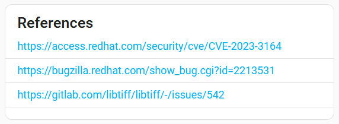
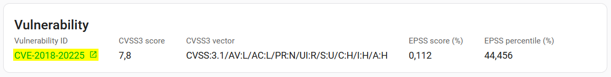
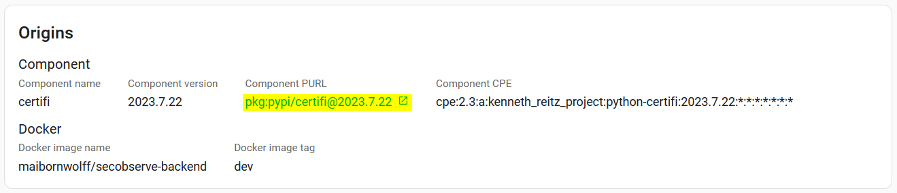
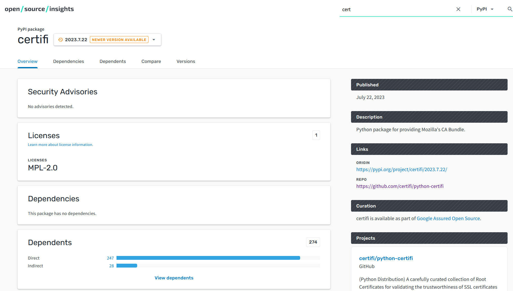

# Links to additional information

## References

Most of the vulnerability scanners include references to further information about the vulnerabilities. These references are imported with the observation and can be accessed by clicking on the link icon in the `References` box, on the right side of the Observation view.

## Vulnerabilities

If an observation is a vulnerability with a CVE or GHSA number, the Vulnerability ID in the `Vulnerability` box will be a link to the [National Vulnerabilities Database (NVD)](https://nvd.nist.gov/vuln) or the [GitHub Advisory Database](https://github.com/advisories).

## Components

If an observation has a component with a PURL as its origin and the package type is in

* Cargo
* Go
* Maven
* npm
* NuGet
* PyPI

the Component PURL in the `Origins` box will be a link to the **open/source/insights** platform.

**open/source/insights** ([https://deps.dev](https://deps.dev)) provides insights into the open source component containing the vulnerability. It helps you to understand the security, licensing, and maintenance aspects of the component.

