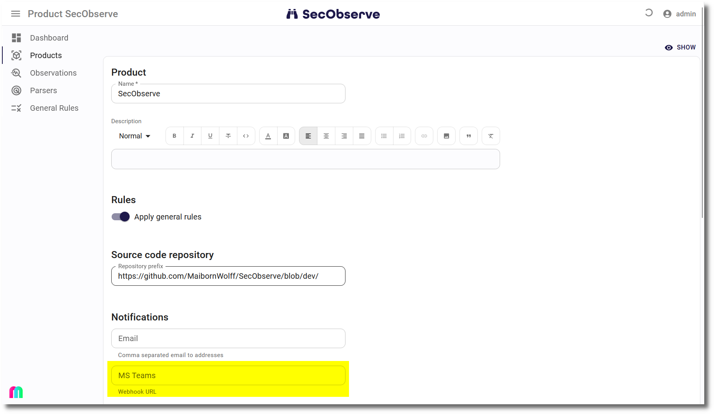
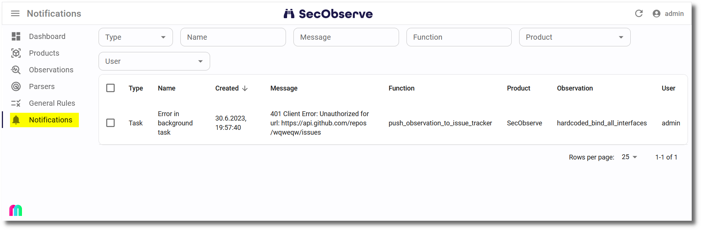

# Notifications

SecObserve can send notifications to email addresses, Microsoft Teams or Slack for 3 kinds of events:

* When the [security gate](../usage/security_gates.md) of a product changes.
* When an exception occurs while processing a request.
* When an exception occurs in a background task.

There is a ratelimiting active to prevent flooding of notifications, if a series of exceptions occurs. The same exception is sent only once during a specified timedelta, which can be configured in the [Settings](../getting_started/configuration.md#admininistration-in-secobserve). The default for this timedelta is 1 hour.

##  Notifications to email addresses

#### Settings in SecObserve

The field `EMAIL_FROM` needs to be set in the [Settings](../getting_started/configuration.md#admininistration-in-secobserve) to be able to send notifications to email addresses for both events. 

#### Notifications for security gates

When creating or editing a product, the field `Email` can be set in the *Notification* section with a comma separated list of email addresses. If the [security gate](../usage/security_gates.md) of the product changes and this field is filled, then a notification is sent each of the email addresses.

#### Notifications for exceptions

An admistrator can configure the field `EXCEPTION_EMAIL_TO` in the [Settings](../getting_started/configuration.md#admininistration-in-secobserve). If an exception occurs while processing a request and this field is filled with a comma separated list of email addresses, a notifications is sent each of the email addresses before returning the HTTP code 500 via the REST API.

##  Notifications to Microsoft Teams and Slack

####  Settings in Microsoft Teams

For both types of notifications an incoming webhook has to be set for a channel, where the notifications shall appear. How to do this is explained in [Create Incoming Webhooks](https://learn.microsoft.com/en-us/microsoftteams/platform/webhooks-and-connectors/how-to/add-incoming-webhook). Copy the URL of the webhook to the clipboard, to have it available to set it in SecObserve.

The messages do not include mentions, but a user can set the "Channel notifications" to "All activities" in Teams, to get an active notification when an entry is generated. 

####  Settings in Slack

For both types of notifications an incoming webhook has to be set for a channel, where the notifications shall appear. How to do this is explained in [Sending messages using Incoming Webhooks](https://api.slack.com/messaging/webhooks). Copy the URL of the webhook to the clipboard, to have it available to set it in SecObserve.

#### Notifications for security gates

When creating or editing a product, the fields `MS Teams` and/or `Slack` can be set in the *Notification* section with the copied webhook URL. If the [security gate](../usage/security_gates.md) of the product changes and this field is filled, then a notification is sent to Microsoft Teams and/or Slack.

#### Notifications for exceptions

An admistrator can configure the fields `EXCEPTION_MS_TEAMS_WEBHOOK` and/or `EXCEPTION_SLACK_WEBHOOK` in the [Settings](../getting_started/configuration.md#admininistration-in-secobserve). If an exception occurs while processing a request and this field is filled with the copied webhook URL, a notifications is sent to Microsoft Teams and/or Slack before returning the HTTP code 500 via the REST API.

## Notifications in the user interface

Notifications are also stored in the database and can be viewed in the user interface.

* **Regular users** can view notifications for changed security gates and exceptions in background tasks for all products where they are a product member.
* **Administrators** can view all notifications.

When a notification is deleted, it is removed from the database and won't be visible anymore for all users.
