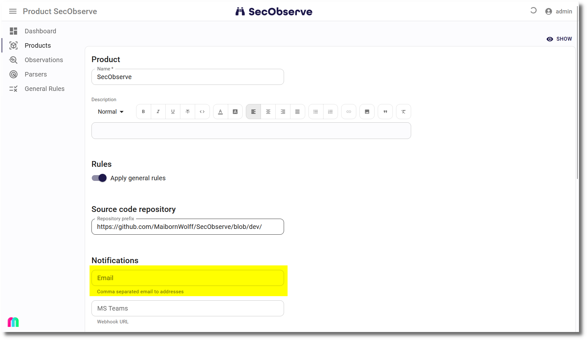

# Notifications

SecObserve can send notifications to email addresses or Microsoft Teams channels for two kinds of events:

* When the [security gate](../usage/security_gates.md) of a product changes.
* When an exception occurs while processing a request.

##  Notifications to email addresses

#### Settings in SecObserve

The field `EMAIL_FROM` needs to be set in the Django Admin user interface to be able to send notifications to email addresses for both events. 

#### Notifications for security gates

When creating or editing a product, the field `Email` can be set in the *Notification* section with a comma separated list of email addresses. If the [security gate](../usage/security_gates.md) of the product changes and this field is filled, then a notification is sent each of the email addresses.

#### Notifications for exceptions

An admistrator can configure the field `EXCEPTION_EMAIL_TO` in the Django Admin user interface. If an exception occurs while processing a request and this field is filled with a comma separated list of email addresses, a notifications is sent each of the email addresses before returning the HTTP code 500 via the REST API.

There is a ratelimiting active to prevent flooding of email inboxes, if a series of exceptions occurs. The same exception is sent only once during a specified timedelta, which can be configured in the Django Admin user interface as well.

##  Notifications to Microsoft Teams channels

####  Settings in Microsoft Teams

For both types of notifications an incoming webhook has to be set for a channel, where the notifications shall appear. How to do this is explained in [Create Incoming Webhooks](https://learn.microsoft.com/en-us/microsoftteams/platform/webhooks-and-connectors/how-to/add-incoming-webhook). Copy the URL of the webhook to the clipboard, to have it available to set it in SecObserve.

The messages do not include mentions, but a user can set the "Channel notifications" to "All activities" in Teams, to get an active notification when an entry is generated. 

#### Notifications for security gates

When creating or editing a product, the field `MS Teams` can be set in the *Notification* section with the copied webhook URL. If the [security gate](../usage/security_gates.md) of the product changes and this field is filled, then a notification is sent to Microsoft Teams.

#### Notifications for exceptions

An admistrator can configure the field `EXCEPTION_MS_TEAMS_WEBHOOK` in the Django Admin user interface. If an exception occurs while processing a request and this field is filled with the copied webhook URL, a notifications is sent to Teams before returning the HTTP code 500 via the REST API.

There is a ratelimiting active to prevent flooding of Teams, if a series of exceptions occurs. The same exception is sent only once during a specified timedelta, which can be configured in the Django Admin user interface as well.
