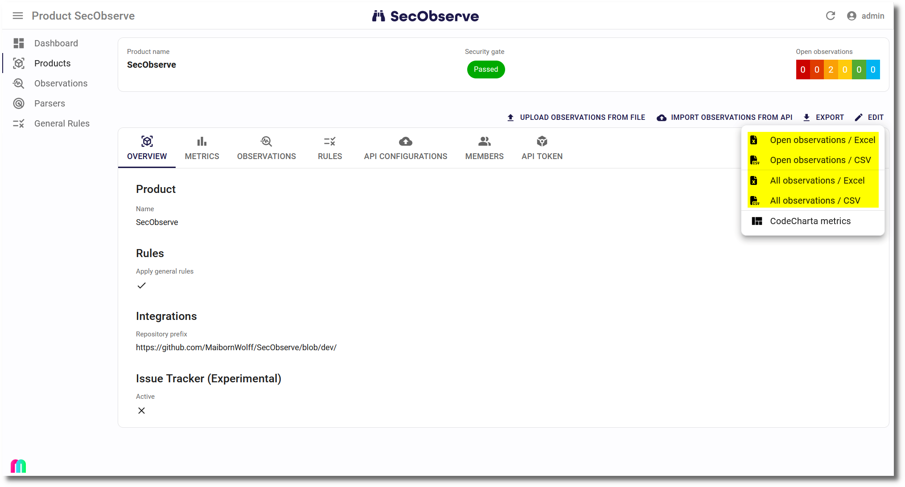

# Export of observations

Observations of a product can be exported to Excel or CSV. When showing a product, there is an `Export` button. When clicking it, it shows a menu with several options to export the observations of this product:

