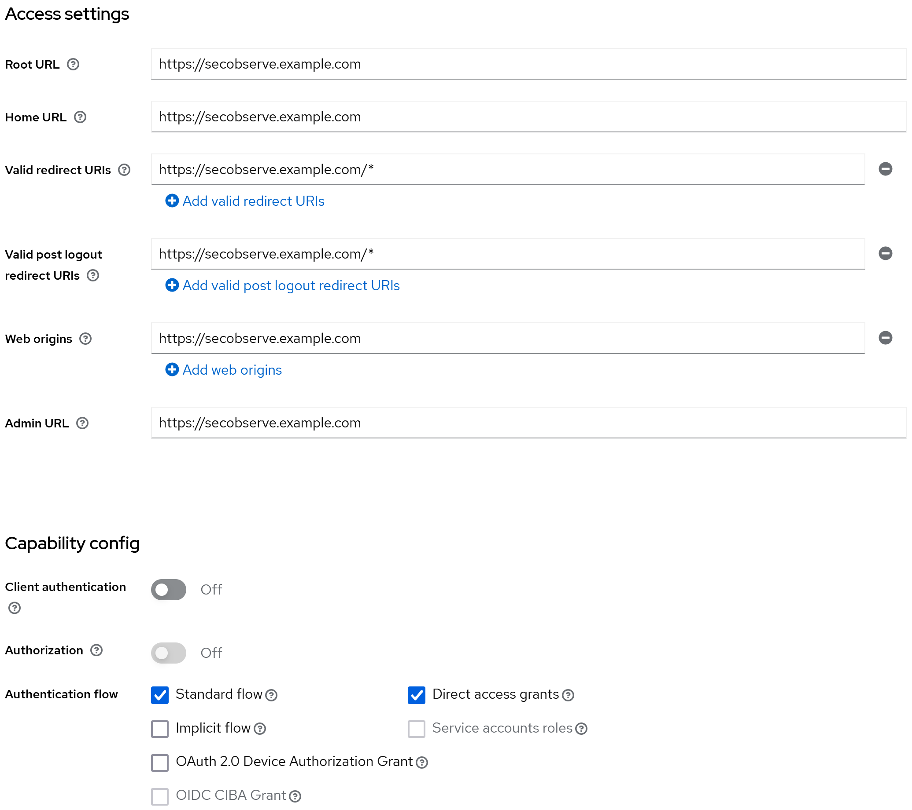
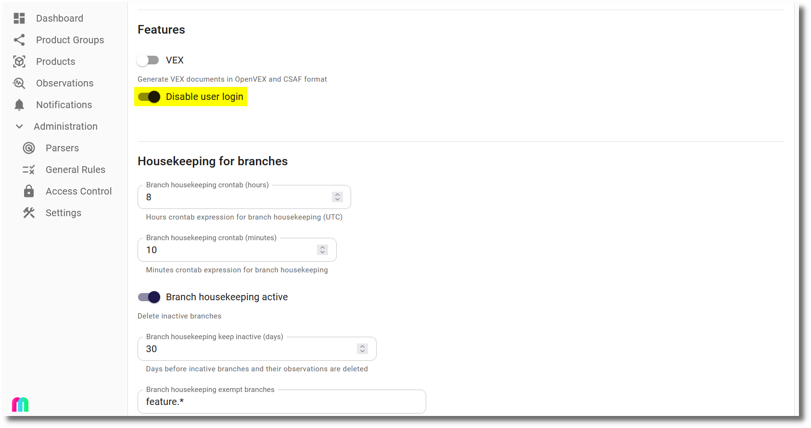
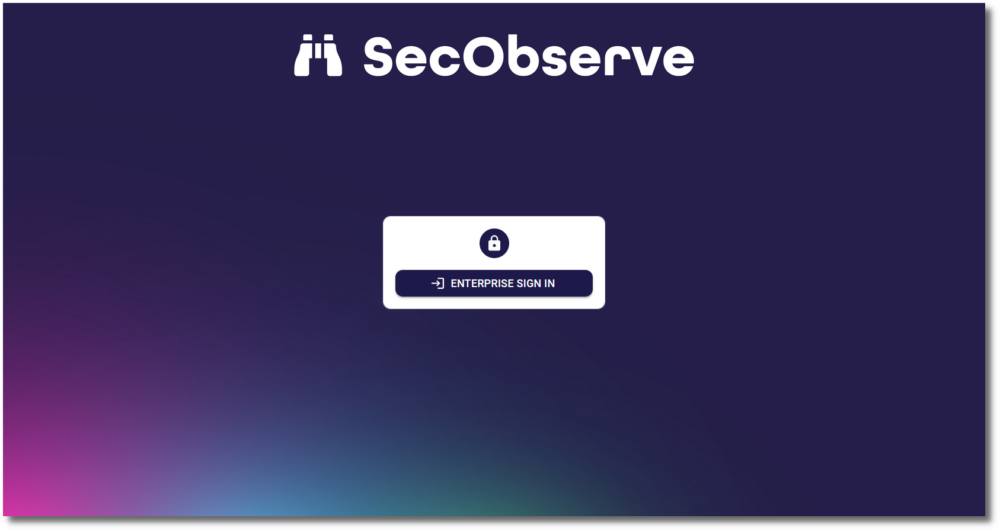

# OpenID Connect authentication

[OpenID Connect](https://openid.net/developers/how-connect-works) authentication has been tested with Keycloak and Azure Active Directory. It should work with other OpenID Connect providers as well, as long as they support the [authorization flow](https://oauth.net/2/grant-types/authorization-code) with [PKCE](https://oauth.net/2/pkce) and without a secret.

## Keycloak

In Keycloak a new OpenID Connect client needs to be created. The client needs to be configured as follows, assuming the frontend is available at `https://secobserve.example.com`:

#### Configuration parameters for SecObserve

Backend

| Environment variable | Value                                               |
|----------------------|-----------------------------------------------------|
| `OIDC_AUTHORITY`     | `https://keycloak.example.com/realms/NAME_OF_REALM` |
| `OIDC_CLIENT_ID`     | `CLIENT_ID`                                         |
| `OIDC_USERNAME`      | `preferred_username`                                |
| `OIDC_FIRST_NAME`    | `given_name`                                        |
| `OIDC_LAST_NAME`     | `family_name`                                       |
| `OIDC_EMAIL`         | `email`                                             |
| `OIDC_GROUPS`        | `groups`                                            |

Frontend

| Environment variable            | Value                                               |
|---------------------------------|-----------------------------------------------------|
| `OIDC_ENABLE`                   | `true`                                              |
| `OIDC_AUTHORITY`                | `https://keycloak.example.com/realms/NAME_OF_REALM` |
| `OIDC_CLIENT_ID`                | `CLIENT_ID`                                         |
| `OIDC_REDIRECT_URI`             | `https://secobserve.example.com`                    |
| `OIDC_POST_LOGOUT_REDIRECT_URI` | `https://secobserve.example.com`                    |

## Azure Active Directory

In Azure Active Directory a new App registration needs to be created.

#### Configuration parameters for SecObserve

Backend

| Environment variable | Value                                              |
|----------------------|----------------------------------------------------|
| `OIDC_AUTHORITY`     | `https://login.microsoftonline.com/TENANT_ID/v2.0` |
| `OIDC_CLIENT_ID`     | `CLIENT_ID`                                        |
| `OIDC_USERNAME`      | `preferred_username`                               |
| `OIDC_FULL_NAME`     | `name`                                             |
| `OIDC_EMAIL`         | `email`                                            |
| `OIDC_GROUPS`        | `groups`                                           |

Frontend

| Environment variable            | Value                                              |
|---------------------------------|----------------------------------------------------|
| `OIDC_ENABLE`                   | `true`                                             |
| `OIDC_AUTHORITY`                | `https://login.microsoftonline.com/TENANT_ID`      |
| `OIDC_CLIENT_ID`                | `CLIENT_ID`                                        |
| `OIDC_REDIRECT_URI`             | `https://secobserve.example.com`                   |
| `OIDC_POST_LOGOUT_REDIRECT_URI` | `https://secobserve.example.com`                   |

## Customize the login dialog

If users should only be able to sign in with OpenID Connect, the login dialog can be customized to hide user and password fields. This can be done by setting the `Disable user login` option in the `Settings` dialog:

Then the login dialog will only show the `Enterprise sign in` button:

If the user and password is needed to login, e.g. for a local admin user, `#force_user_login` can be added to the URL (like `https://secobserve.example.com/#/login#force_user_login`) to force the user and password fields to be shown.
