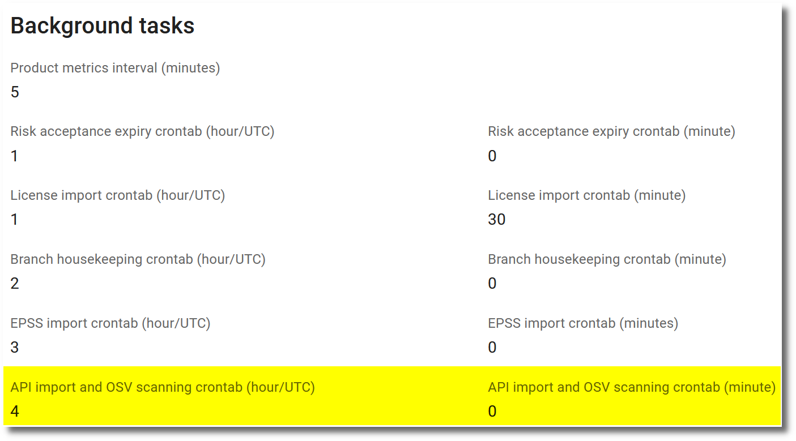

# Vulnerability scanning from OSV database [experimental]

The components of a product can be scanned for vulnerabilities using the OSV database. The OSV database is a database of open-source vulnerabilities, maintained by Google and is available at [https://osv.dev/](https://osv.dev/).

There are 2 preconditions for a product to be met before using the OSV database for vulnerability scanning:

* License information has to be imported, only then all components are available for scanning.
* The flag `OSV scanning enabled` in the product settings has to be activated.

OSV delivers vulnerabilities for a component, without regard to the version of the component, plus a list of affected versions. Currently these package managers are supported directly to get the affected versions, by using information from the PURL of the component:

* **bitnami:** Bitnami
* **conan:** ConanCenter
* **cran:** CRAN
* **cargo:** crates.io
* **golang:** Go
* **hackage:** Hackage
* **hex:** Hex
* **maven:** Maven
* **npm:** npm
* **nuget:** NuGet
* **pub:** Pub
* **pypi:** PyPI
* **gem:** RubyGems
* **swift:** SwiftURL

To correctly identify Linux packages, the Linux distribution and version has to be set in the product or branch settings according to [OSV affected package specification](https://ossf.github.io/osv-schema/#affectedpackage-field). If it is not set for a branch, the product settings are used. Examples are:

| Linux distribution | Version   |
|--------------------|-----------|
| Alpine             | v3.21     |
| Ubuntu             | 22.04:LTS |
| Red Hat            | rhel_aus:8.4::appstream |

## Manual import

If both preconditions are met, the OSV scan can be started manually from the `Import` menu. If a branch is selected, the scan will be performed on the components of the branch. If no branch is selected, the scan will be performed on the components of all branches and components without a branch.

{ width="40%" style="display: block; margin: 0 auto" }

## Automatic import

OSV scanning can be configured to run automatically at a specific time. There is a general setting and a setting per API configuration.

#### General setting

In the `Features` section of the [Settings](../getting_started/configuration.md#admininistration-in-secobserve) the automatic OSV scanning can be enabled or disabled for the whole SecObserve instance.

{ width="65%" style="display: block; margin: 0 auto" }

The hour (in UTC time) and minute, when the automatic [API imports](./api_import.md/#automatic-import) and OSV scanning will run, can be set in the `Background tasks` section. A restart of the SecObserve instance is required to apply the changes.

{ width="70%" style="display: block; margin: 0 auto" }

#### Setting per product

Only products that have `Automatic OSV scanning enabled` turned on will be imported automatically.

