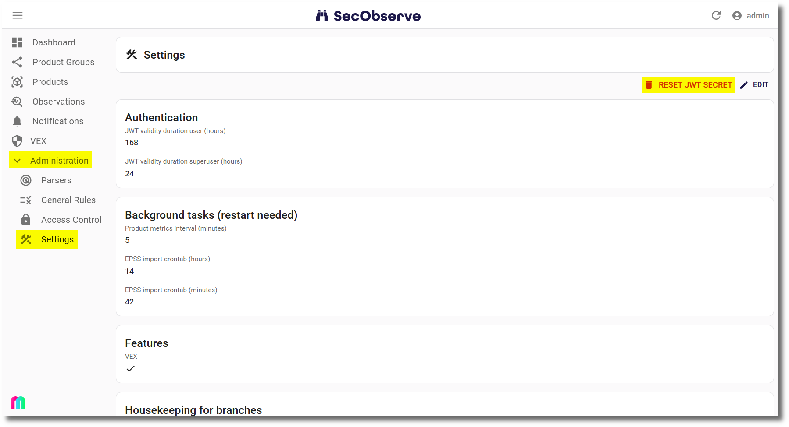
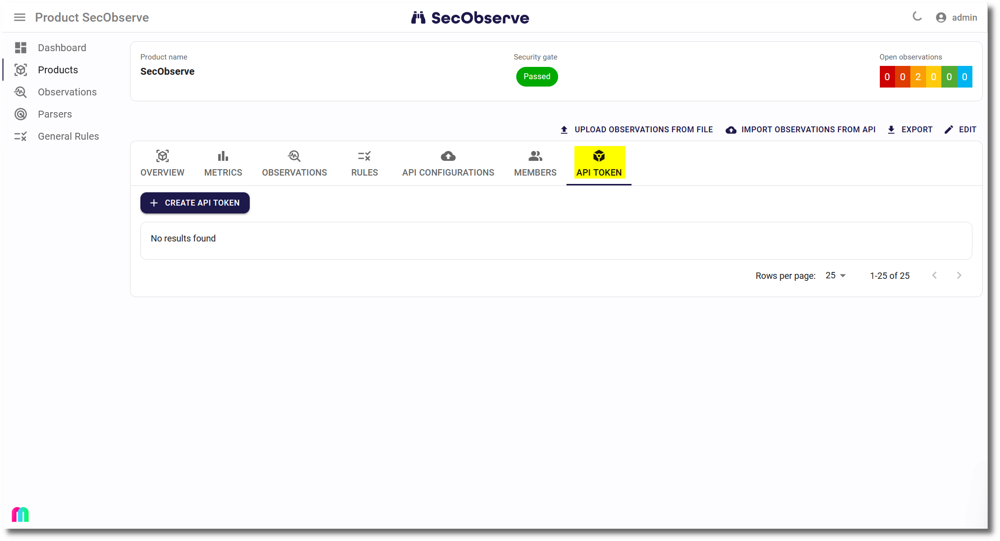
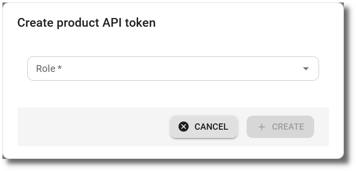
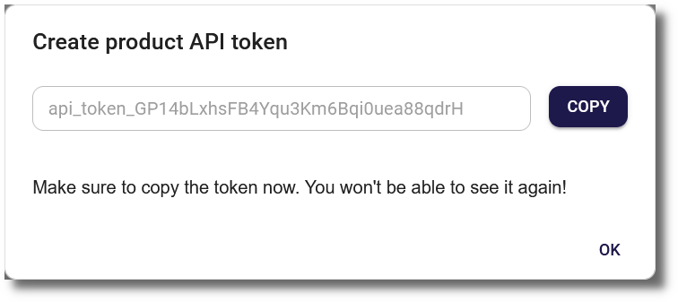
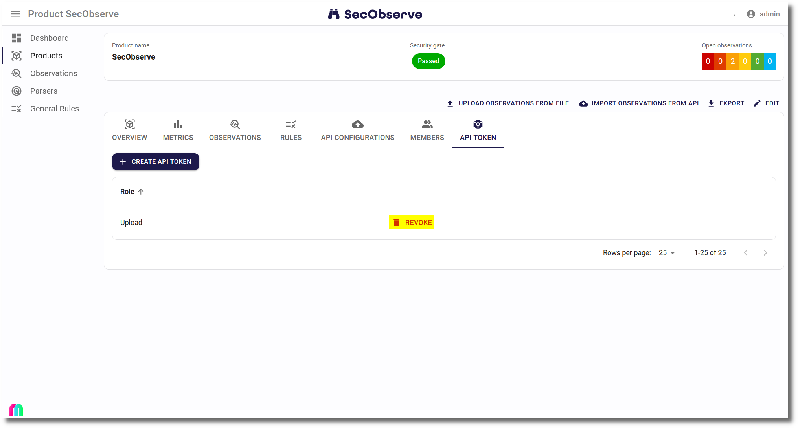

# REST API

SecObserve is build with an API first approach, every functionality needed to use SecObserve is covered by the REST API.

## Authentication

#### JWT

[JWT](https://jwt.io) authentication is used by SecObserve's frontend.

|                                         |                                     |
|-----------------------------------------|-------------------------------------|
| **Endpoint**                            | `/api/authentication/authenticate/` |
| **Validity duration for regular users** | 7 days / 168 hours  ^1)^            |
| **Validity duration for superusers**    | 1 day / 24 hours  ^1)^              |
| **HTTP header**                         | `Authorization: JWT `*`token`*      |

 ^1)^ Values can be changed by the administrators.

 A secret is stored in the database that is used to generate the JWT token. The secret can be reset to a new value with a button in the settings:
 
 
 
 After a confirmation dialog, this will invalidate all existing tokens and users have to log in again.

#### API token

API tokens are used for other integration scenarios, e.g. to call the REST API from a CI/CD pipeline to import observations.

|                                  |                                         |
|----------------------------------|-----------------------------------------|
| **Validity**                     | Until revokation                        |
| **HTTP header**                  | `Authorization: APIToken `*`token`*     |

API tokens can be created for a product or a user.

##### Product API token

A role (see [Roles and permissions](../usage/users_permissions.md#roles-and-permissions)) must be selected during creation of a product API token, to determine the permissions of the API token for the product.

{ width="60%" style="display: block; margin: 0 auto" }

The API token can be seen only once after it has been created. It must be copied to ensure that it is not lost.

{ width="60%" style="display: block; margin: 0 auto" }

Only one API token can be created per product. If it needs to be replaced, it must be revoked first.

##### User API token

An API token for a user can only be created and revoked with API calls. The token can be seen only once, when it is created. Afterwards there is no way to see that API token again. If it is lost it needs to be revoked and a new one has to be created, as only one API token is allowed per user.

The API token has the same permissions for the same products as the user.

|                                  |                                         |
|----------------------------------|-----------------------------------------|
| **Endpoint to create API token** | `/api/authentication/create_api_token/` |
| **Endpoint to revoke API token** | `/api/authentication/revoke_api_token/` |

## Interactive API documentation

The full documentation of the REST API is available at `<BACKEND_URL>/api/oa3/swagger-ui`.
