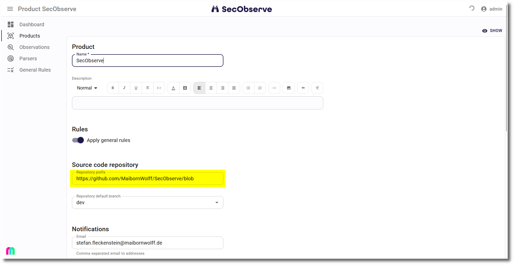

# Source code repositories

Observations can have a source file plus start and end lines as an origin. During the assessment of the observation it is often helpful to view the source code.

## Setting the repository in a product

When creating or editing a product, the field `Repository prefix` can be set. This needs to be the prefix of the URL to show a file in the repository. 

* If the observations of the product have the branch set, then for **GitLab** it is something like `https://gitlab.secobserve.de/secobserve/secobserve/-/blob`, for **GitHub** it looks like `https://github.com/SecObserve/codecharta/blob`. 
* If the observations don't have the branch set, then a branch need to be at the end of the repository prefix, e.g. `https://gitlab.secobserve.de/secobserve/secobserve/-/blob/dev` or `https://github.com/SecObserve/codecharta/blob/dev`.
* **Azure DevOps** does not need the branch in the repository prefix, an example is `https://dev.azure.com/secobserve/SecObserve/_git/SecObserve_Frontend`. If the observations have a branch set, then this branch will be used in the URL, otherwise the default branch of the repository will be used.

## Showing the link 

If the `Repository prefix` is set in the product and the observation has a source file as an origin, then name of the source file will be shown as a link to the source in the repository.

