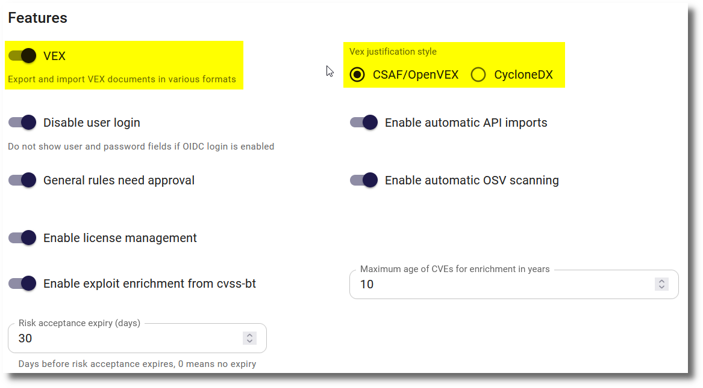

# VEX documents

A VEX (Vulnerability Exploitability eXchange) document is a form of a security advisory that indicates whether a product or products are affected by a known vulnerability or vulnerabilities. SecObserve supports the export of VEX documents in two formats:

* The [Common Security Advisory Framework](https://docs.oasis-open.org/csaf/csaf/v2.0/os/csaf-v2.0-os.html) (CSAF) format is an [OASIS](https://www.oasis-open.org/) standard 
* [OpenVEX](https://github.com/openvex/spec/blob/main/OPENVEX-SPEC.md) is a community-driven format, maintained by an [OpenSSF](https://openssf.org/) special interest group

## Feature flag

The VEX feature is is disabled by default because not all installations will use it. It can be enabled by setting the feature flag `FEATURE_VEX` in the [Settings](../getting_started/configuration.md#admininistration-in-secobserve):

{ width="80%" style="display: block; margin: 0 auto" }

Enabling the feature flag will make the VEX functionality available in the main navigation bar and enable the "VEX justification" field in several places.

## Create a new VEX document

To create a VEX document, the user has to define a set of attributes in a dialog. Some of them are different for either a CSAF or OpenVEX document. Other attributes are common to both formats:

| Attribute             | Optionality | Description |
|-----------------------|:-----------:|-------------|
| `Product`             | optional    | If a product is selected, only vulnerabilities for that product will be included in the VEX document. |
| `Vulnerabilities`     | optional    | Zero or more names of vulnerabilities to be included in the VEX document, e.g. `CVE-2021-44228` |
| `Branches / Versions` | optional    | If a product is selected, the VEX document can be limited to cover only the selected branches / versions of this product. |
| `ID prefix`           | mandatory   | The `ID prefix` is part of of the unique identifier of the VEX document. The unique id has the format `prefix_year_counter`, where the counter is increased by 1 for every new document per prefix and year. This unique id will stored in a designated attribute in the VEX document and used for the filename of the VEX document. |

Either a product or at least one vulnerability has to be selected.

After pushing the **Create** button in the dialog, the VEX document with the version 1 will be created and ready for download. Additionally a database entry with all attributes is created, which can be selected later to create an updated version of the VEX document

## Update a VEX document

After selecting the entry of either a CSAF or OpenVEX document from the respective list, a form shows the details of its attributes and a button to update a document. Some of the attributes can be changed for a new version of the document. If there have been no changes to the included vulnerabilities, no new document will be created. Otherwise a new version of the document will be created and ready for download.

## Import VEX documents

VEX documents can be imported in CSAF or OpenVEX format. After importing the file, the document will be parsed and the VEX statements will be applied to the referenced observations. A user needs to be `superuser` to import VEX documents. 

When observations are imported, the VEX statements will be applied to the referenced observations as well.

**How are the referened observations determined?**

First, the relevant products are determined by the product PURL. The PURL of the product or the PURL of a branch must match the product PURL in the VEX statements.  

Second, the relevant observations are determined by their Vulnerability ID and optionally the component PURL. The Vulnerability ID of the observation must be the same as the Vulnerability ID of the VEX statements. If the VEX statement contains a component PURL, this must match the vulnerability PURL in the component PURL of the observation.

**When do PURLs match?**

Two PURLs match if:

* The `type` is the same in both PURLs.
* Both PURLs have the same `namespace` or there is no `namespace` in both PURLs.
* The `name` is the same in both PURLs.
* Either both PURLs have the same `version`, there is no `version` in both PURLs or there is a `version` in one PURL but not in the other one.
* When both PURLs have `qualifiers`, then all key/value pairs that exist in both PURLs must be the same. When both PURLs do not have `qualifiers` or some of the keys in one set of `qualifiers` do not exist in the other PURL, then the PURLs match as well.
* Either both PURLs have the same `subpath`, there is no `subpath` in both PURLs or there is a `subpath` in one PURL but not in the other one.
