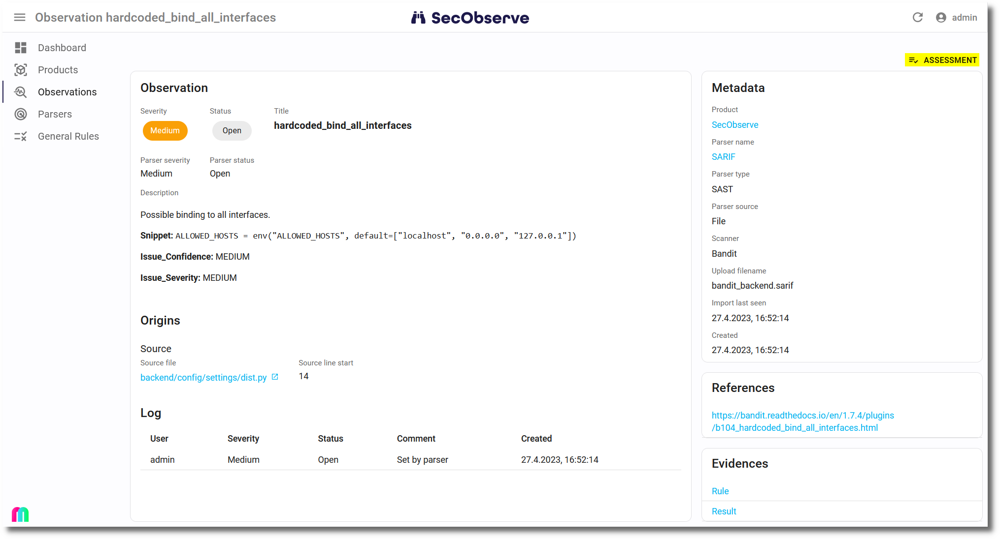

# Assess observations

With an assessment of an observation the user can change two attributes of an observation:

* The **severity** given by the parser must not necessarily match the severity of the observation for the current product.
* All observations have initially the **status** `Open`. The result of an investigation how to deal with the observation might say, the observation must not be fixed because it is ...
    * ... `In review` and needs further investigation.
    * ... already `Resolved`. You have to be aware that the observation will be set back to `Open` if it will be found in a subsequent import.
    * ... a `Duplicate` of another observation.
    * ... a `False positive` that has been detected by the scanner wrongly.
    * ... `Risk accepted`, a decision that a breach because of that observation can be managed.
    * The system is `Not affected` because the observation has been mitigated by a measure.

The dialog to enter the assessment can be opened when showing the observation: 

In the assessment dialog the user can change either the severity and/or the status and has to enter a mandatory comment to explain the change:

{ width="60%" style="display: block; margin: 0 auto" }

A new entry with the changed values is stored in the `Observation Log` after the assessment has been saved.
