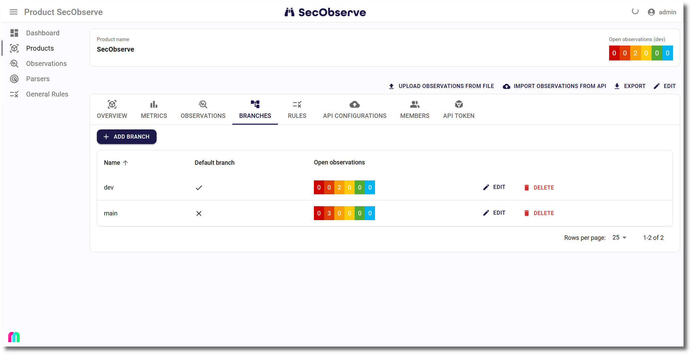

# Working with branches

## Branches in the product

A product has a list of branches. They can either be created manually from the **Branches** tab of the product or will be created automatically, when observations are imported via the the API or the GitHub actions / GitLab templates when a branch name is used that didn't exist before for that product.

The list of branches shows the severities of open observations for each branch.

Clicking on the name of a branch brings up the list of open observations for that branch.

## Repository default branch

The **Repository default branch** should always be set, when branches are used in the observations. The metrics on the dashboard and on the **Metrics** tab as well as the severites in the header when showing a product are calculated using the observations where the default branch is set.

The repository default branch can be set manually while editing a product. If it is not set manually, it will be set automatically with the first branch that is created, either after importing observations with a branch name or by manually creating a branch.

When the repository default branch is set, the Observations tab shows a button to show all open observations for the default branch.

