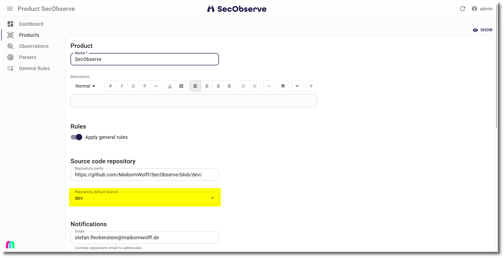
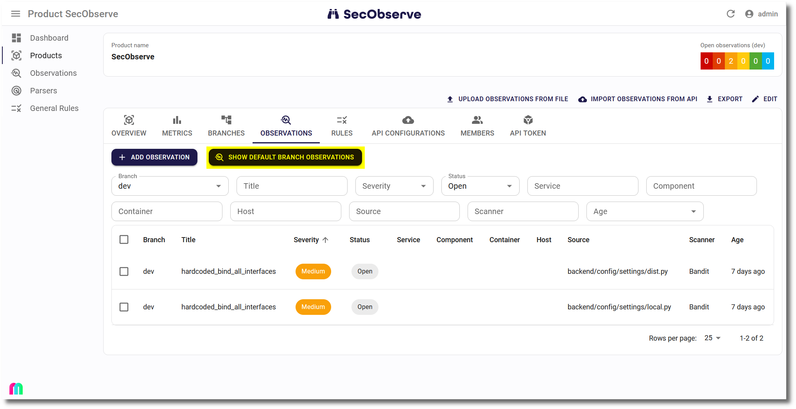
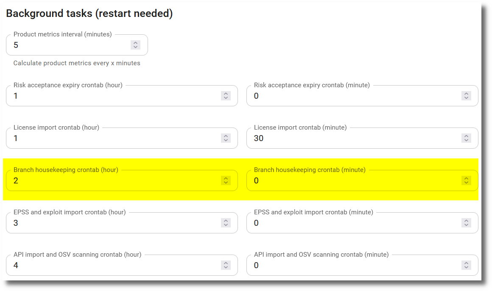
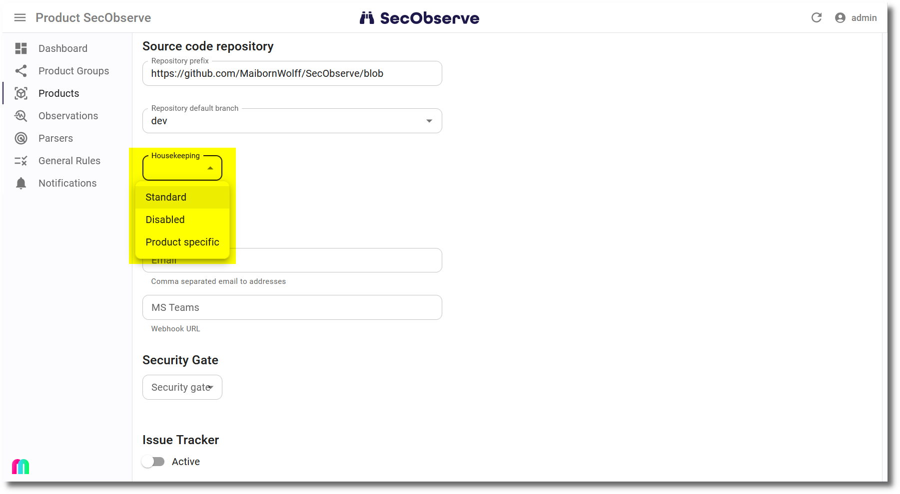

# Branches and Versions

Branches and versions are an optional feature of the product. They can be used to separate the observations for different branches or versions of a product. If only one branch or version is used to develop a product, this feature can be ignored.

## List of branches and versions

A product has a list of branches / versions. They can either be created manually from the **Branches / Versions** tab of the product or will be created automatically, when observations are imported using a branch / version name that didn't exist before for that product.

The list of branches / versions shows the severities of open observations for each branch / version.

Clicking on the name of a branch / version brings up the list of open observations for that branch / version.

!!! warning
    When a branch / version is deleted, all observations for that branch will be deleted as well.

## Default branch / version

The **Default branch / version** should always be set, when branches / versions are used for the observations.

* The metrics on the dashboard and on the **Metrics** tab are calculated using the observations where the default branch / version is set.
* The number of severities in the header when showing a product are for the observations where the default branch / version is set as well.
* [Issues in GitHub, GitLab or Jira](../integrations/issue_trackers.md) are created only for the default branch / version.
* The default branch / version cannot be deleted and is exempt from the [housekeeping](#housekeeping).

The default branch / version can be set manually while editing a product. If it is not set manually, it will be set automatically with the first branch / version that is created, either after importing observations with a branch / version name or by manually creating a branch / version.

The Observations tab shows a button to show all open observations for the default branch / version.

## Housekeeping

Inactive branches / versions will be deleted automatically after a certain time. Inactivity is defined as the number of days since the last import of observations for a branch / version.

#### Parameters

The parameters are set globally in the [Settings](../getting_started/configuration.md#admininistration-in-secobserve) and can be partially overridden per product.

| Parameter global | Description |
|------------------|-------------|
| **BRANCH_HOUSEKEEPING_CRONTAB_MINUTE** | Minutes crontab expression for branch / version housekeeping | 
| **BRANCH_HOUSEKEEPING_CRONTAB_HOUR** | Hours crontab expression for branch / version housekeeping (UTC) |
| **BRANCH_HOUSEKEEPING_ACTIVE** | If this parameter is set, inactive branches / versions will be deleted automatically. |
| **BRANCH_HOUSEKEEPING_KEEP_INACTIVE_DAYS** | Days before incative branches / versions and their observations are deleted |
| **BRANCH_HOUSEKEEPING_EXEMPT_BRANCHES** | Regular expression which branches / versions to exempt from deletion |

Per default the task to delete inactive branches / version including their observations is scheduled to run every night at 02:00 UTC time. This default can be changed by administrators via the **Background tasks** section in the [Settings](../getting_started/configuration.md#admininistration-in-secobserve). Hours are always in UTC time.

{ width="80%" style="display: block; margin: 0 auto" }

#### Product specific settings

A product can override the housekeeping behaviour by setting the `Housekeeping` attribute:

* **Standard**: Use the instance-wide definition, this is the default.
* **Disabled**: Do not delete inactive branches for that product.
* **Product specific**: Use product specific settings for deletion of inactive branches.

#### Protect branches

A branch can be proceted to prevent it from being deleted by the housekeeping task. This can be done by setting the `Protect from housekeeping` attribute of a branch.
