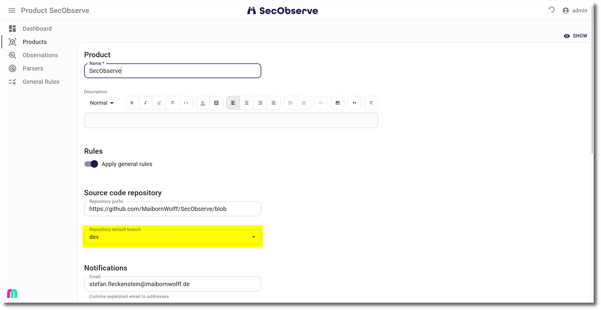

# Branches

Branches are an optional feature of the product. They can be used to separate the observations for different branches of a product. If only one branch is used to develop a product, the branch feature can be ignored.

## List of branches

A product has a list of branches. They can either be created manually from the **Branches** tab of the product or will be created automatically, when observations are imported using a branch name that didn't exist before for that product.

The list of branches shows the severities of open observations for each branch.

Clicking on the name of a branch brings up the list of open observations for that branch.

!!! warning
    When a branch is deleted, all observations for that branch will be deleted as well.

## Repository default branch

The **Repository default branch** should always be set, when branches are used in the observations.

* The metrics on the dashboard and on the **Metrics** tab are calculated using the observations where the default branch is set.
* The number of severities in the header when showing a product are for the observations where the default branch is set as well.
* [Issues in GitHub, GitLab or Jira](../integrations/issue_trackers.md) are created only for the default branch.
* The default branch cannot be deleted and is exempt from the [housekeeping](#housekeeping).

The repository default branch can be set manually while editing a product. If it is not set manually, it will be set automatically with the first branch that is created, either after importing observations with a branch name or by manually creating a branch.

The Observations tab shows a button to show all open observations for the default branch.

## Housekeeping

Inactive branches will be deleted automatically after a certain time. Inactivity is defined as the number of days since the last import of observations for a branch.

#### Parameters

The parameters are set globally in the [admin user interface](../../getting_started/configuration/#admin-user-interface) and can be partially overridden per product.

| Parameter global | Description |
|------------------|-------------|
| **BRANCH_HOUSEKEEPING_CRONTAB_MINUTES** | Minutes crontab expression for branch housekeeping | 
| **BRANCH_HOUSEKEEPING_CRONTAB_HOURS** | Hours crontab expression for branch housekeeping (UTC) |
| **BRANCH_HOUSEKEEPING_ACTIVE** | If this parameter is set, inactive branches will be deleted automatically. |
| **BRANCH_HOUSEKEEPING_KEEP_INACTIVE_DAYS** | Days before incative branches and their observations are deleted |
| **BRANCH_HOUSEKEEPING_EXEMPT_BRANCHES** | Regular expression which branches to exempt from deletion |

Per default the task to delete inactive branches including their observations is scheduled to run every night at 02:00 UTC time. This default can be changed by administrators via the [admin user interface](../../getting_started/configuration/#admin-user-interface). The expressions for `BRANCH_HOUSEKEEPING_CRONTAB_MINUTES` and `BRANCH_HOUSEKEEPING_CRONTAB_HOURS` have to be valid values according to [https://huey.readthedocs.io/en/latest/api.html#crontab](https://huey.readthedocs.io/en/latest/api.html#crontab):

* `*` = every distinct value (every minute, every hour)
* `*/n` = run every `n` times, i.e. hours=’*/4’ == 0, 4, 8, 12, 16, 20
* `n` = run every `n` (minutes 0 - 60, hours 0 - 24)
* `m-n` = run every time m..n
* `m,n` = run on m and n

Hours are always in UTC time.

#### Product specific settings

A product can override the housekeeping behaviour by setting the `Housekeeping` attribute:

* **Standard**: Use the instance-wide definition, this is the default.
* **Disabled**: Do not delete inactive branches for that product.
* **Product specific**: Use product specific settings for deletion of inactive branches.

#### Protect branches

A branch can be proceted to prevent it from being deleted by the housekeeping task. This can be done by setting the `Protect from housekeeping` attribute of a branch.
