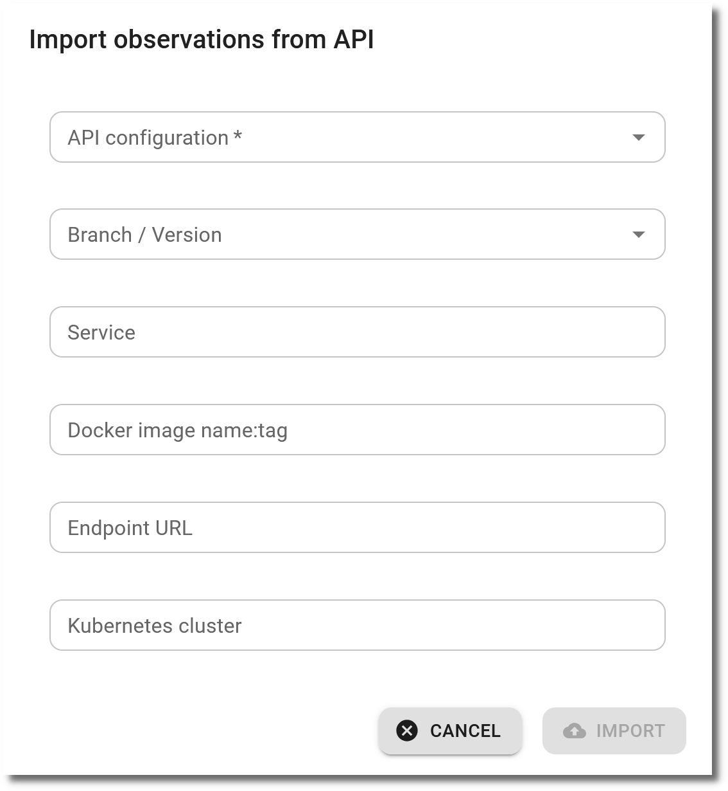

# Import observations

## Import from CI pipelines via the API

[GitHub actions and GitLab CI templates](../integrations/github_actions_and_templates.md) support running vulnerability checks and importing the results into SecObserve via GitHub workflows or GitLab CI pipelines in an efficient way.

## Import from the frontend

Alternatively observations can be imported via the user interface. When showing a product, there are buttons to either upload a file or to import from an API:

#### Upload of files

{ width="50%" style="display: block; margin: 0 auto" }

A file needs to be selected. The parser to interpret the content of the file will be detected automatically. Optional are attributes for the branch / version, the origin as service, docker image, endpoint URL and Kubernetes cluster. If `Supress licenses` is checked, no licenses will be imported, only observations.

#### API import

{ width="50%" style="display: block; margin: 0 auto" }

Before importing observations from an API, an API configuration needs to be created for the product. This API configuration specifies how to access the API (URL, API key,Query, Basic Authentication, SSL Verify, ...). Optional for the import are attributes for the branch / version, the origin as service, docker image, endpoint URL and Kubernetes cluster.

## Import algorithm

The import algorithm has to decide, if an observation already exists and needs to be updated or it is new and needs to be created. But how does the import algorithm identifies an observation to make this decision? Two terms help to understand how that works:

* **Identity hash**: The `identity hash` is a SHA256 hash code of the concatenation of the observation's title and all its origins ^[1]^. Two observations with the same `identity hash` are defined as identical.
* **Vulnerability check**: An import for one product, one branch / version and one file name resp. one API configuration is a so-called vulnerability check.

A flowchart visualizes the import algorithm:

*[1]: The tag of the docker image is not part of the `identity hash` to allow updates of the docker image without creating a new observation.*

## Initial status of observations

The initial status of imported observations is `Open` by default. If the attribute **Status "In review" for new observations** in a Product or a Product Group is set to `true`, the initial status of new observations will be `In review` for the respective Product or all Products of the Product Group.
