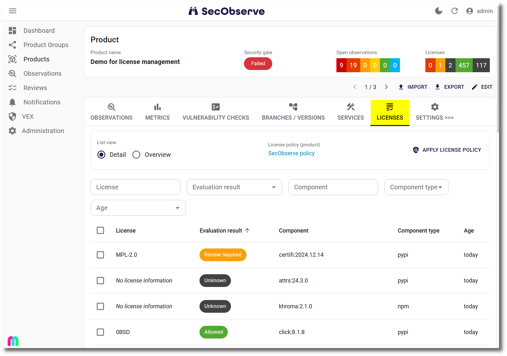
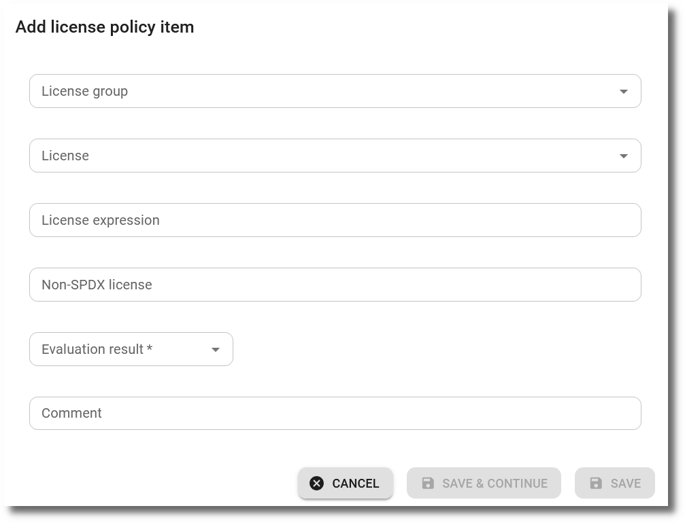

# License management

## Activating / deactivating license management

License management is activated by default. If it is not used in an organization it can be be deactivted via a feature flag in the [Settings](../getting_started/configuration.md#admininistration-in-secobserve).

{ width="80%" style="display: block; margin: 0 auto" }

If license management is deactivated:

* The `Licenses` menu is not visible in the navigation.
* The [automatic import of SPDX licenses](../integrations/license_data.md#spdx-licenses) is deactivated.
* Licenses for components are not imported from CycloneDX files and the `License` tab is not visible in the Product view.

## Managing licenses in products

#### Importing components with licenses

When importing data from CycloneDX SBOMs, the licenses of the components are imported as well, if they are available in the SBOM and the parameter `SO_SUPPRESS_LICENSES` is not set or set to `false` ^1)^. The licenses are shown in the `License` tab of the Product view.

**^1)^** `SO_SUPPRESS_LICENSES` will be set to `true` by the *Grype*, *Trivy Filesystem* and *Trivy Image* GitHub actions / GitLab templates if not set otherwise, to not accidently import licenses.

After clicking on an entry, the details of the component and its license are shown.

#### Evaluation of licenses

A License Policy for the Product can be set, when editing the product settings.

{ width="80%" style="display: block; margin: 0 auto" }

If no License Policy is set, all licenses are evaluated as `Unkown`. If a License Policy is set, the licenses are evaluated according to the policy:

* **Allowed:** There is no problem using the component with that license.
* **Forbidden:** Using the component with that license might lead to legal problems and the component cannot be used for the Product.
* **Review:** The license shall be reviewed and the License Policy shall be updated after the review.
* **Unknown:** The license is not included in the License Policy.
* **Ignored:** The component is not relevant for the license management.

License expressions are evaluated by their included licenses, if the operators are either all `AND` or all `OR`. If the operators are mixed or other operators are used, the expression is evaluated as `Unknown`, if there is no explicit rule for this license expression.

A good strategy is to start with an existing License Policy and when needed make a copy of it and adjust the rules to the needs of the Product.

## Managing License Policies

A `License Policy` defines the rules for the usage of licenses in a Product. 

The list of `License Policies` can be found in the `Licenses` sub-menu under `Administration`.

Within the `License Policy` itself a comma-separated list of component (e.g. `apk` or `deb`) types can be defined, which shall be ignored in the license evaluation. This can be useful for operating system packages in a Docker container, which are not relevant for the license management.

The attribute `Public` defines, if the License Policy is visible for all users or only for the members of the policy.

With the `Apply` button the rules of the License Policy are applied to all products, that have this License Policy set.

The `Copy` button creates a new License Policy with the same rules, which can be adjusted for a specific Product.

A `License Policy` has a list of items, which are the rules of the policy. It can be 

* a rule for a **License Group** or
* a rule for a specific **SPDX license**, 
* a rule for a **license expression** or
* a rule for an **unkown license** string, e.g. a license that is not in the SPDX list or a license expression.

{ width="60%" style="display: block; margin: 0 auto" }

Additionally a `License Policy` has a list of user members and a list of authorization group members, which define who has access to a license policy, either read-only or as a manager. To define read-only members is not necessary, if the policy is defined as `Public`.

{ width="60%" style="display: block; margin: 0 auto" }

## Managing License Groups

A `License Group` is a collection of licenses with similar license conditions. There is a predefined list of license groups, taken from the classification of the [Blue Oak Council](https://blueoakcouncil.org/). Administrators can import license group from the ScanCode LicenseDB, see [License data import](../integrations/license_data.md#scancode-licensedb).

As with `License Policies`, a `License Group` 

* can be found in the `Licenses` sub-menu under `Administration`,
* can be copied if adjustments are needed for a specific Product,
* can be public, so that all users can see the group and its licenses and
* has a list of user members and a list of authorization group members, which define who has access to a license group, either read-only or as a manager.
