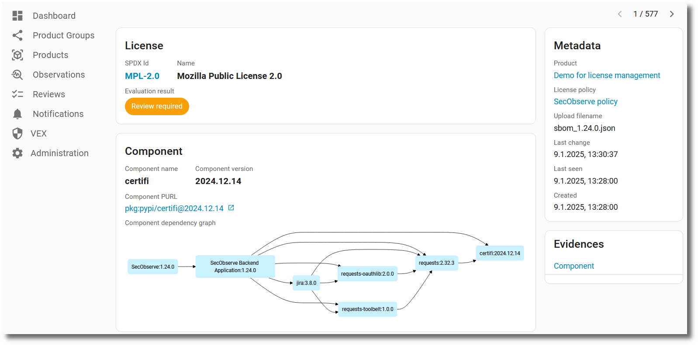
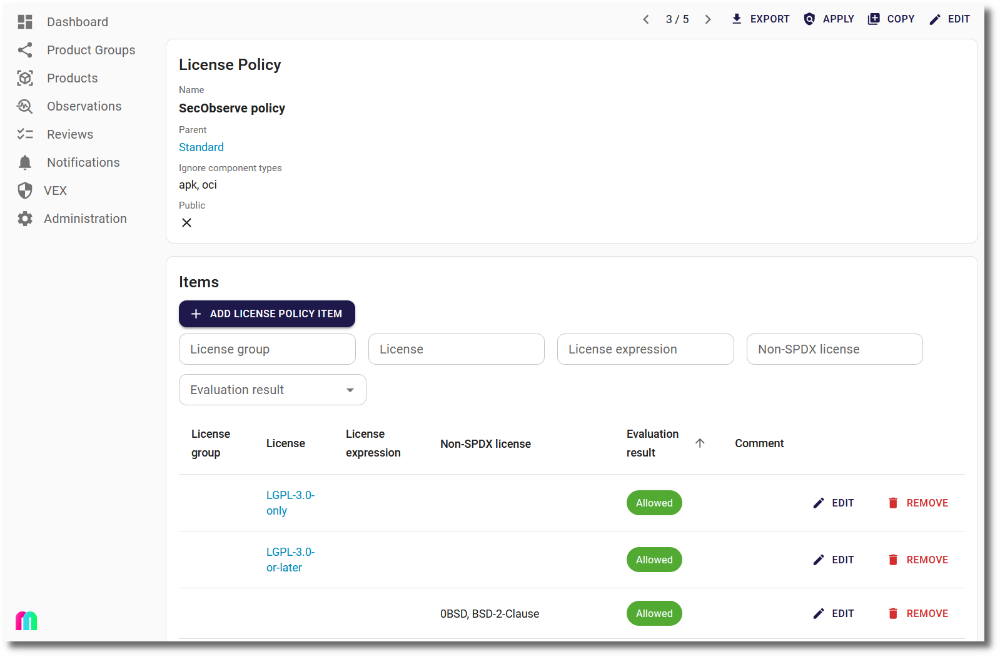

# License management

## Activating / deactivating license management

License management is activated by default. If it is not used in an organization it can be be deactivted via a feature flag in the [Settings](../getting_started/configuration.md#admininistration-in-secobserve).

{ width="80%" style="display: block; margin: 0 auto" }

If license management is deactivated:

* The `Licenses` menu is not visible in the navigation.
* The [automatic import of SPDX licenses](../integrations/license_data.md#spdx-licenses) is deactivated.
* Licenses for components are not imported from CycloneDX or SPDX files and the `License` tab is not visible in the Product view.

## Managing licenses in products

#### Importing components with licenses

When uploading data from CycloneDX or SPDX SBOMs, the licenses of the components are imported as well, if they are available in the SBOM. The components and licenses are shown in the `License` tab of the Product view.

After clicking on an entry, the details of the component and its license are shown.

#### Declared and concluded licenses

> Declared licenses and concluded licenses represent two different stages in the licensing process within software development.

> * **Declared licenses** refer to the initial intention of the software authors regarding the licensing terms under which their code is released. 
> * **Concluded licenses** on the other hand, are the result of a comprehensive analysis of the project's codebase to identify and confirm the actual licenses of the components used, which may differ from the initially declared licenses. 

> While declared licenses provide an upfront indication of the licensing intentions, concluded licenses offer a more thorough understanding of the actual licensing within a project, facilitating proper compliance and risk management.

*(Copied from the [CycloneDX specification](https://cyclonedx.org/docs/1.6/json/#components_items_licenses_oneOf_i0_items_license_acknowledgement))*

Both types of acknowledgement are imported from an SBOM and shown in the UI. If a CycloneDX SBOM doesn't include a license acknowledgement, it will be treated as `Declared`.

Additionally, a user can manually add a concluded license, with the button `ADD / EDIT CONCLUDED LICENSE`, for example when there was no license or there was a wrong license in the SBOM.

There is a priority for the license acknowledgement. 

1. If a **manual concluded license** has been set, this is used for the evaluation of the license and is shown in lists.
2. The **imported concluded license** is used, if it is available and no manual concluded license is set.
3. Otherwise the **imported declared license** is used for evaluation and lists if it was in the SBOM.

#### Evaluation of licenses

A License Policy for the Product can be set, when editing the product settings.

{ width="80%" style="display: block; margin: 0 auto" }

If no License Policy is set, all licenses are evaluated as `Unknown`. If a License Policy is set, the licenses are evaluated according to the policy:

* **Allowed:** There is no problem using the component with that license.
* **Forbidden:** Using the component with that license might lead to legal problems and the component cannot be used for the Product.
* **Review:** The license shall be reviewed and the License Policy shall be updated after the review.
* **Unknown:** The license is not included in the License Policy.
* **Ignored:** The component is not relevant for the license management.

License expressions are evaluated by their included licenses, if the operators are all either `AND` or `OR`. If other operators are used, e.g. `WITH`, the expression is evaluated as `Unknown`, if there is no explicit rule for this license expression.

If multiple licenses have been found for a component, they are evaluated like an `AND` expression. If for example one license is `Allowed` and the other one is `Forbidden`, the component is evaluated as `Forbidden`. 

A good strategy is to start with an existing License Policy and when needed make a copy of it and adjust the rules to the needs of the Product.

## Managing License Policies

A `License Policy` defines the rules for the usage of licenses in a Product. 

The list of `License Policies` can be found in the `Licenses` sub-menu under `Administration`.

A `License Policy` can have another license policy as a `Parent`. If a license policy has a parent, the rules of the parent are also valid for the child policy, but existing rules of the parent can be overriden and new rules can be added. A license policy which is a parent cannot have a parent itself.

Within the `License Policy` itself a comma-separated list of component types (e.g. `apk` or `deb`) can be defined, which shall be ignored in the license evaluation. This can be useful for operating system packages in a Docker container, which are not relevant for the license management.

The attribute `Public` defines, if the License Policy is visible for all users or only for the members of the policy.

**Actions**

* The `Export` button opens a sub-menu to exports the License Policy either as a SecObserve specific JSON or YAML file or in a format that can be used with [sbom-utility](https://github.com/CycloneDX/sbom-utility?tab=readme-ov-file#license-list-subcommand), using the `--config-license` parameter. The SecObserve specific output format is specified as a [JSON schema](../specification/secobserve_license_policy_schema.json).
* With the `Apply` button the rules of the License Policy are applied to all products, that have this License Policy set.
* The `Copy` button creates a new License Policy with the same rules, which can be adjusted for a specific Product.

A `License Policy` has a list of items, which are the rules of the policy. It can be 

* a rule for a **License Group** or
* a rule for a specific **SPDX license**, 
* a rule for a **license expression** or
* a rule for an **non-spdx license** string, e.g. a license that is not in the SPDX list or a license expression.

{ width="60%" style="display: block; margin: 0 auto" }

Additionally a `License Policy` has a list of user members and a list of authorization group members, which define who has access to a license policy, either read-only or as a manager. To define read-only members is not necessary, if the policy is defined as `Public`. Additionally, users can view all license policies that are assigned to a product, if they have access to the product.

{ width="60%" style="display: block; margin: 0 auto" }

## Managing License Groups

A `License Group` is a collection of licenses with similar license conditions. There is a predefined list of license groups, taken from the classification of the [Blue Oak Council](https://blueoakcouncil.org/). Administrators can import license group from the ScanCode LicenseDB, see [License data import](../integrations/license_data.md#scancode-licensedb).

As with `License Policies`, a `License Group` 

* can be found in the `Licenses` sub-menu under `Administration`,
* can be copied if adjustments are needed for a specific Product,
* can be public, so that all users can see the group and its licenses,
* has a list of user members and a list of authorization group members, which define who has access to a license group, either read-only or as a manager.
* users can view all license groups that are assigned to a license policy which is assigned to a product, if they have access to the product.
