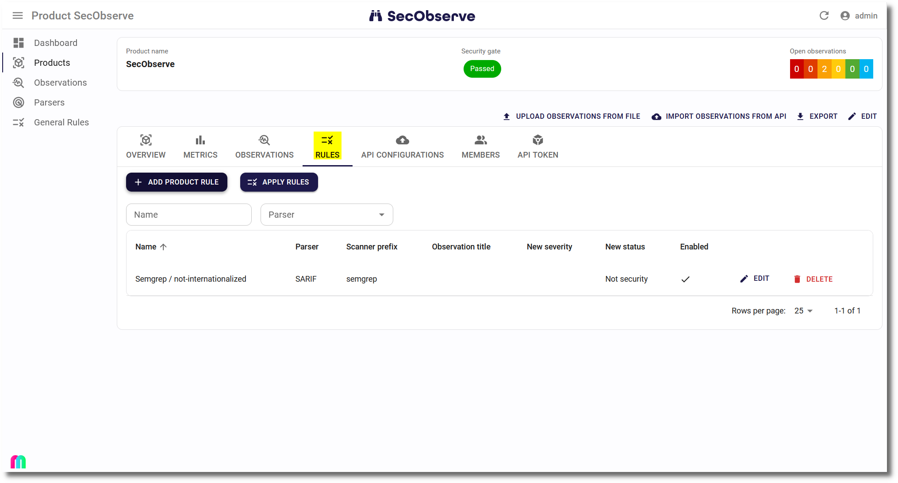

# Rule engine

Sometimes the result of a scanner doesn't fit to the product's needs. Either the severity or the status need to be adjusted. To avoid having to do many manual assessments regularly, a built-in rule engine can adjust severity and/or status directly with the import of observations.

This can remove a lot of noise, for example by setting observations to `False positive`, in case the ruleset of the scanner can not be adjusted appropriately. 

## Rules

Rules can be managed in two ways:

* **General rules** will be applied for all products. A product can be excluded from general rules in its settings.
* **Product rules** are only valid for one product or for all products of a product group.

These fields are used to decide if a rule shall be applied for an observation:

* **Parser** *(mandatory)*: The observation has been imported with this parser.
* **Scanner prefix** *(optional)*: The observation has been generated by a scanner which name starts with this prefix. A prefix is used here because the scanner field in the observation often contains the version of the scanner as well, which is typically irrelevant for the rule.
* **Observation title** *(optional)*: Regular expression to match the observation's title
* **Origin component name:version** *(optional)*: Regular expression to match the component name:version
* **Origin docker image name:tag** *(optional)*: Regular expression to match the docker image name:tag
* **Origin endpoint URL** *(optional)*: Regular expression to match the endpoint URL
* **Origin service name** *(optional)*: Regular expression to match the service name
* **Origin source file** *(optional)*: Regular expression to match the source file
* **Origin cloud qualified resource** *(optional)*: Regular expression to match the cloud qualified resource, which is the concatenation of account (AWS) or subscription (Azure) or project (GCP) with the resource

If an observation matches all fields containing a value, than the new severity and/or new status is set in the observation and the rule's description is stored as a comment in the `Observation Log`.

## Approvals

With the default settings of the product, the rule will be activated right away if enabled. If more control is needed, an approval can be configured:

* For **General rules** the feature `General rules need approval` can be set in the [Settings](../getting_started/configuration.md#admininistration-in-secobserve).
* For **Product rules** the setting `Rules need approval` can be set while creating or editing a product. The setting is also available for product groups. If it is set for a product group, it will be inherited by all products in that group.

If the approval is required, the dialog showing the rule  will show a button to either approve or reject the assessment:

Be aware, that the user who has created or edited the rule is not allowed to approve or reject it. The approval must be done by another user.

{ width="60%" style="display: block; margin: 0 auto" }
