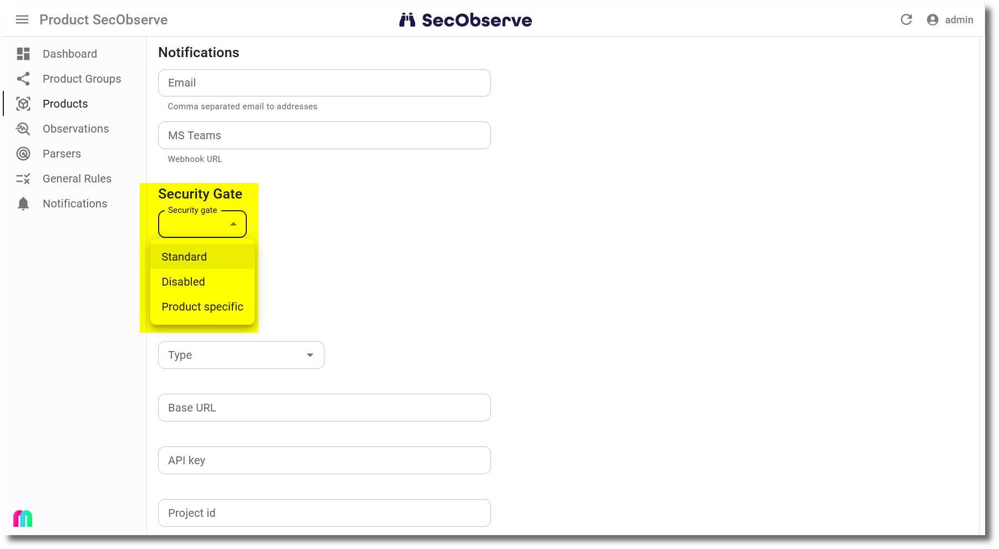

# Security gates

A security gate shows, that a product does not exceed a defined amount of vulnerabilities per severity. It can be `Passed` if the product is under or at the defined thresholds or `Failed` if the product has more observations for at least one severity.

There is an instance-wide definition of the thresholds, that can be changed by an administrator. The default is:

| Severity | Threshold |
|----------|:---------:|
| Critical | 0         |
| High     | 0         |
| Medium   | 99999     |
| Low      | 99999     |
| None     | 99999     |
| Unkown   | 99999     |

A product can decide how to deal with security gates by setting the attribute `Security gate active`:

* ***empty***: Use the instance-wide definition, this is the default.
* **No**: Do not calculate and show a security gate.
* **Yes**: Use product specific thresholds to calculate the security gate.

