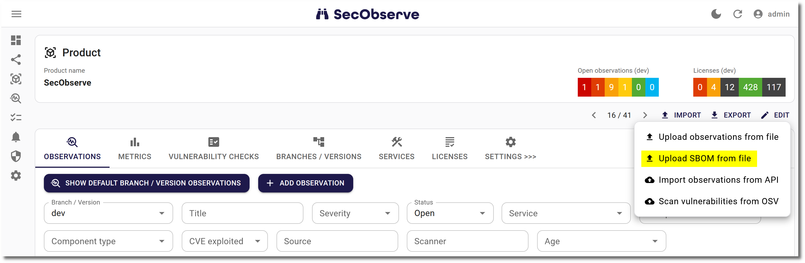
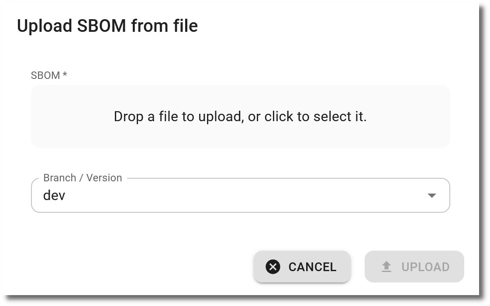

# Upload SBOMs

Uploading an SBOM for a Product or Branch / Version imports all components with their licenses and dependencies. This is a precondition to use [License management](../usage/license_management.md) or [OSV scanning](../integrations/osv_scan.md). When uploading a CycloneDX file, no vulnerabilities will be imported, just components with their licenses. To import vulnerabilities from a CycloneDX file, [Import observations](../usage/import_observations.md) has to be used.

Currently [CycloneDX](https://cyclonedx.org/) and [SPDX](https://spdx.dev) files are supported, both in JSON format.

## Import from CI pipelines via the API

There is a [GitHub action and GitLab CI template](../integrations/github_actions_and_templates.md) available to import an SBOM shortly.

Alternatively, the [REST API](../integrations/rest_api.md) can be used to import an SBOM, with the endpoints `/api/import/file_upload_sbom_by_id/` and `/api/import/file_upload_sbom_by_name/`.

## Import from the frontend

Additionally observations can be imported via the user interface. When showing a product, there is a respective button in the **Import** menu:

{ width="50%" style="display: block; margin: 0 auto" }

A file needs to be selected. The parser to interpret the content of the file will be detected automatically. The Branch / Version is optional.

When uploading a CycloneDX file here, no vulnerabilities will be imported, just components with their licenses. To import vulnerabilities from a CycloneDX file, [Import observations](../usage/import_observations.md) has to be used.

## Import algorithm

The import algorithm to decide, if a component with its license already exists it is new is similar as for [importing observations](../usage/import_observations.md#import-algorithm).
