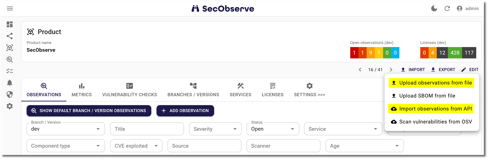
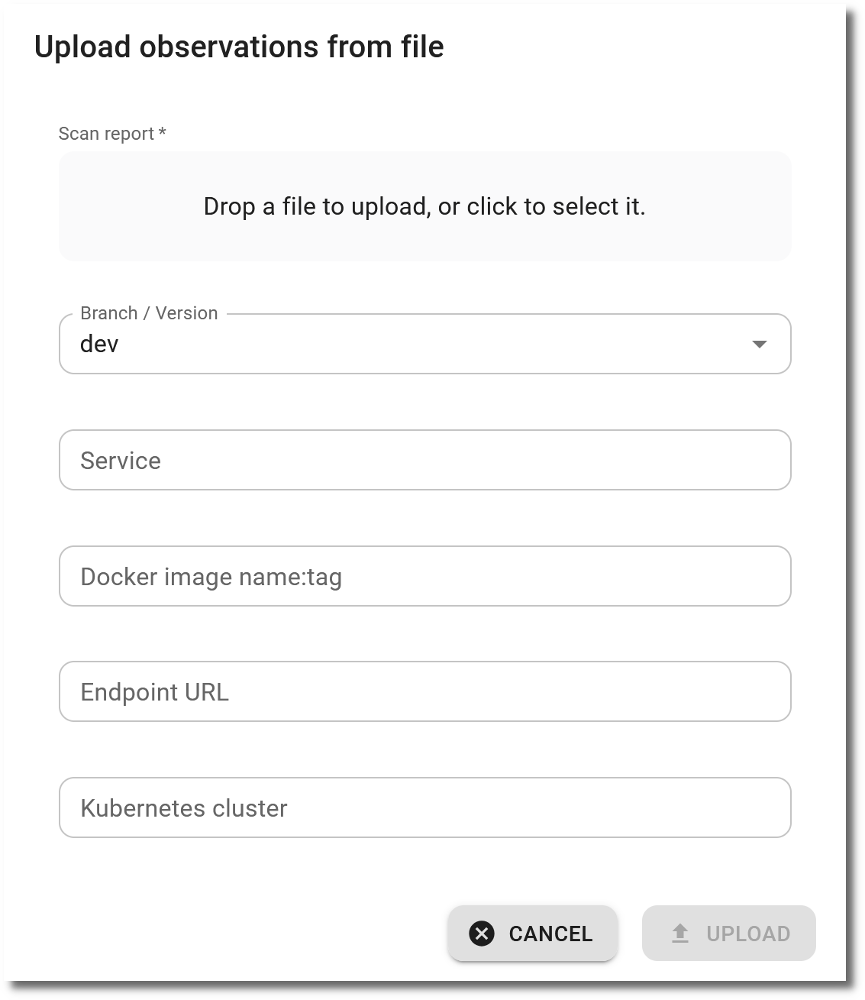

# Upload SBOM

Uploading an SBOM for a Product or Branch / Version imports all components with their licenses and dependencies. This is a precondition to use [License management](../usage/license_management.md) or [OSV scanning](../integrations/osv_scan.md).

## Import from CI pipelines via the API

[GitHub actions and GitLab CI templates](../integrations/github_actions_and_templates.md) support running vulnerability checks and importing the results into SecObserve via GitHub workflows or GitLab CI pipelines in an efficient way.

## Import from the frontend

Alternatively observations can be imported via the user interface. When showing a product, there are buttons to either upload a file or to import from an API:

{ width="50%" style="display: block; margin: 0 auto" }

A file needs to be selected. The parser to interpret the content of the file will be detected automatically. Optional are attributes for the branch / version, service, docker image, endpoint URL and Kubernetes cluster.

When uploading a CycloneDX file here, only the vulnerabilities will be imported. To import all components with their licenses, [Upload SBOM](../usage/upload_sbom.md) has to be used.

## Import algorithm

The import algorithm has to decide, if an observation already exists and needs to be updated or it is new and needs to be created. But how does the import algorithm identifies an observation to make this decision? Two terms help to understand how that works:
