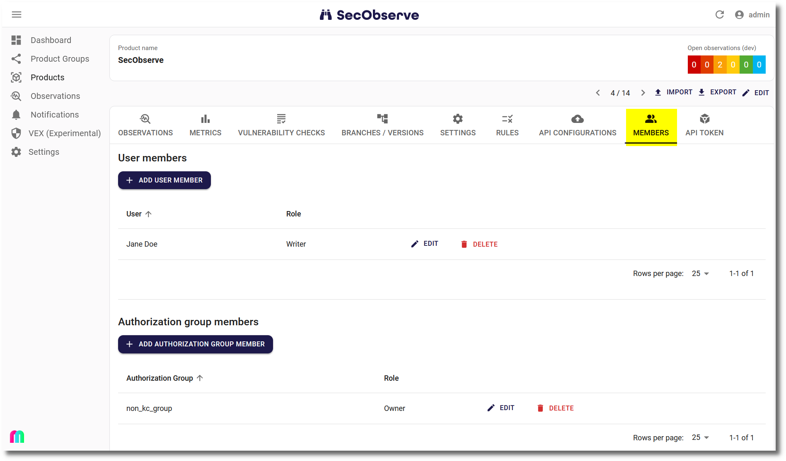

# Users and permissions

## Users

{ width="40%" style="display: block; margin: 0 auto" }

SecObserve supports two types of users:

* **Internally managed users**: You need a username and password given by a SecObserve administrator and use the `SIGN IN WITH USER` button.
* **Users managed in a directory:** The button `ENTERPRISE SIGN` will redirect you to login page of your users directory, if [OpenID Connect](../integrations/oidc_authentication.md) is configured.

Users have specified permissions depending on their type and role in a product.

## User types

The user type can be set by flags in the user administration:

* **Superusers** are the administrators of the system.
* **External users** do not belong to the organization, e.g. customers or partners.
* **Internal users** are all users who are not superusers or external users.

There are some general permissions based on the user's type:

|                       | Internal | External | Superuser |
|-----------------------|:--------:|:--------:|:---------:|
| Create Product Groups | X        | -        | X         |
| Create Product        | X        | -        | X         |
|                       |          |          |           |
| View General Rules    | X        | X        | X         |
| Create General Rules  | -        | -        | X         |
| Edit General Rules    | -        | -        | X         |
| Delete General Rules  | -        | -        | X         |
|                       |          |          |           |
| Access Admin UI       | -        | -        | X         |

## Roles and permissions

While superusers have permission to view and edit all data, internal and external users must be a product member with a specific role to access the product and its data. Product members of a product group have access to all products of that group with their respective role.

|                          | Reader | Writer | Maintainer | Owner | Upload |
|--------------------------|:------:|:------:|:----------:|:-----:|:------:|
| View Product Group       | X      | X      | X          | X     | -      |
| Edit Product Group       | -      | -      | X          | X     | -      |
| Delete Product Group     | -      | -      | -          | X     | -      |
|                          |        |        |            |       |        |
| View Product             | X      | X      | X          | X     | -      |
| Import Observations      | -      | X      | X          | X     | X      |
| Edit Product             | -      | -      | X          | X     | -      |
| Delete Product           | -      | -      | -          | X     | -      |
|                          |        |        |            |       |        |
| View Observation         | X      | X      | X          | X     | -      |
| Create Observation       | -      | X      | X          | X     | -      |
| Edit Observation ^1)^    | -      | X      | X          | X     | -      |
| Assess Observation       | -      | X      | X          | X     | -      |
| Delete Observation       | -      | -      | -          | X     | -      |
|                          |        |        |            |       |        |
| View Product Rules       | X      | X      | X          | X     | -      |
| Create Product Rules     | -      | -      | X          | X     | -      |
| Edit Product Rules       | -      | -      | X          | X     | -      |
| Apply Rules to Product   | -      | -      | X          | X     | -      |
| Delete Product Rules     | -      | -      | X          | X     | -      |
|                          |        |        |            |       |        |
| View API Configuration   | X      | X      | X          | X     | -      |
| Create API Configuration | -      | -      | X          | X     | -      |
| Edit API Configuration   | -      | -      | X          | X     | -      |
| Delete API Configuration | -      | -      | X          | X     | -      |
|                          |        |        |            |       |        |
| View VEX                 | X      | X      | X          | X     | -      |
| Create VEX ^3)^          | -      | -      | X          | X     | -      |
| Edit VEX ^3)^            | -      | -      | X          | X     | -      |
| Delete VEX^3)^           | -      | -      | X          | X     | -      |
|                          |        |        |            |       |        |
| View Product Member      | X      | X      | X          | X     | -      |
| Create Product Member    | -      | -      | X ^2)^     | X     | -      |
| Edit Product Member      | -      | -      | X ^2)^     | X     | -      |
| Delete Product Member    | -      | -      | X ^2)^     | X     | -      |

**^1)^** Only manually created observations can be edited

**^2)^** Maintainers are not allowed to manipulate Owners of that product

**^3)^** Only for VEX documents (CSAF or OpenVEX) linked to a product. For VEX documents without a product, the user who created the VEX document is the owner of the document and can perform all actions on it.
